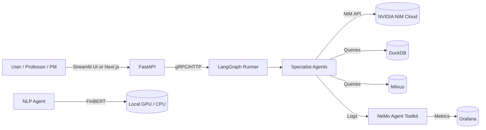
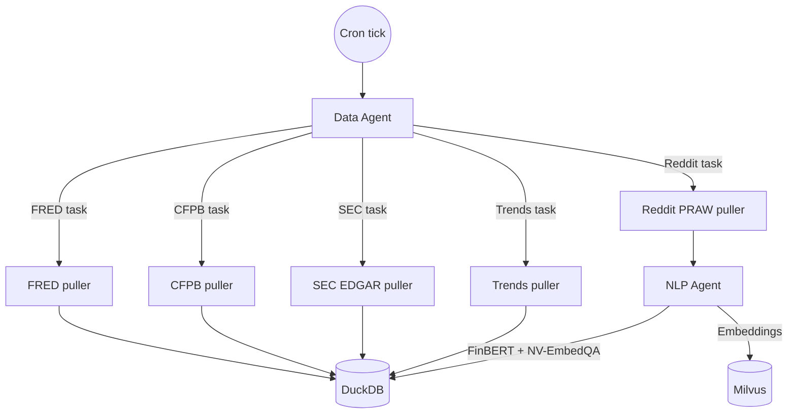
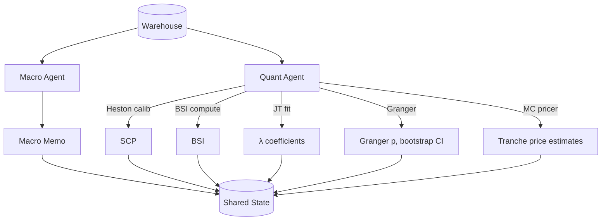
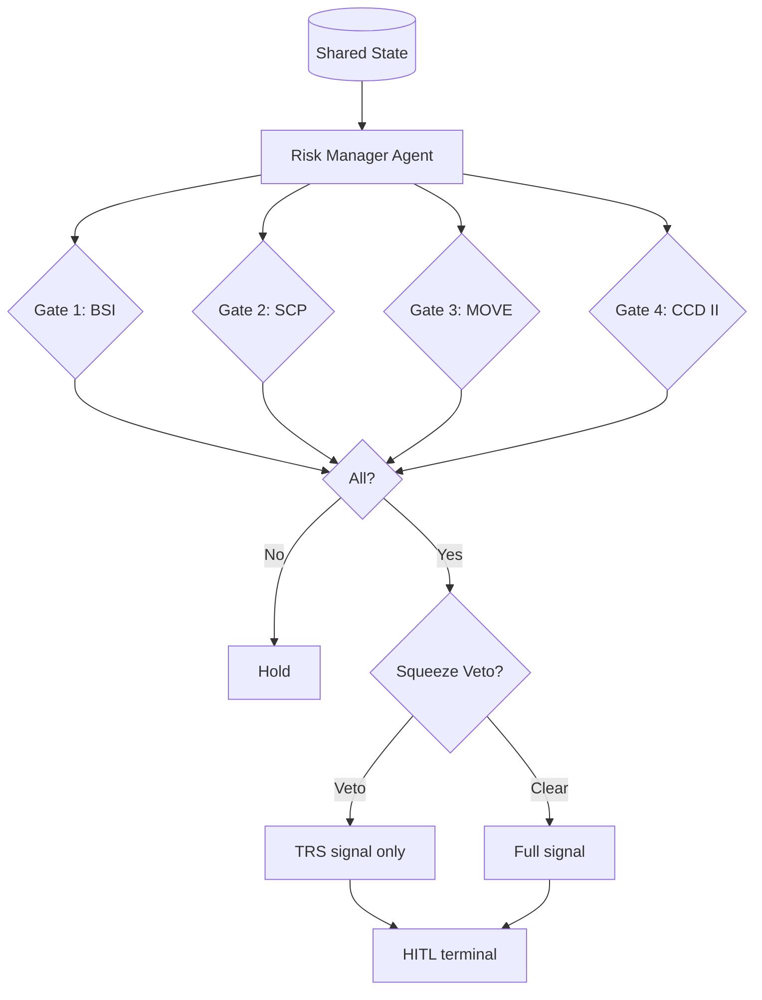

# The Micro-Leverage Epoch

## An Agentic AI Framework for Detecting the Buy-Now-Pay-Later Credit Collapse Through Alternative Data, with a Structured-Credit Expression of the Short Thesis

**Preliminary Research Paper — Version 0.1**
**Author:** [Author], Class 580, Spring 2026
**Status:** Research proposal and methodology. Empirical results pending execution of the agentic pod described herein.
**Date:** April 17, 2026

---

## Abstract

We present a preliminary framework for the quantitative detection and structured-credit expression of a hypothesized credit collapse in the Buy-Now-Pay-Later (BNPL) consumer lending sector — what we term the **Micro-Leverage Epoch**. Unlike the mortgage-backed subprime crisis of 2007–2008, the BNPL credit stack is hidden from traditional credit bureaus: micro-loans do not report to Experian, Equifax, or TransUnion, producing a *structural information asymmetry* in which 63% of BNPL borrowers carry multiple concurrent loans across non-reporting platforms while reported delinquency rates remain benignly near 1.8–2.6% (Consumer Financial Protection Bureau 2023; Di Maggio, Katz, and Williams 2022). We argue that this asymmetry is the precise condition under which *alternative data* — consumer-complaint volume, social-media distress sentiment, fixed-income option-implied volatility, and ABS trustee-report microstructure — can function as a *leading* indicator of realized default, and that a properly structured trade expressing this view must avoid the equity short-squeeze risk that has destroyed prior fundamental short-sellers of consumer-fintech stocks.

We propose a bifurcated quantitative architecture: (i) a **BNPL Stress Index (BSI)** composed of alternative-data signals, validated by Granger causality against realized Affirm Master Trust (AFRMMT) tranche-level stress; (ii) a **Structural Complexity Premium (SCP)** derived from Heston stochastic-volatility pricing of issuer equity options, used strictly as a valuation trigger on the *equity signal layer* and never as an ABS pricing model; (iii) a **Jarrow-Turnbull reduced-form credit-intensity model** with a dynamic default hazard λ(t) = ƒ(BSI, MOVE) for the actual pricing of junior ABS tranches; and (iv) a **Squeeze Defense Layer** monitoring short-interest utilization, days-to-cover, and 25-delta implied-volatility skew to veto directional equity expressions when retail-driven squeeze risk is elevated.

The strategy is operationalized through a **multi-agent agentic AI pod** — a LangGraph state machine orchestrating NVIDIA Nemotron reasoning models across specialized agents (Data, Macro, Quant, Risk Manager, Report) with retrieval-augmented grounding over SEC EDGAR filings, CFPB complaints, and FRED time series. The pod runs continuously, emits a four-gate trade signal (BSI ∧ SCP ∧ MOVE ∧ CCD-II-proximity), and routes execution exclusively through Total Return Swap (TRS) receiver positions on junior tranches of BNPL asset-backed securitizations — isolating the credit thesis from equity-market squeeze dynamics.

This paper presents (a) the economic theory and five-tier taxonomy underlying the thesis, (b) the mathematical specifications of BSI, SCP, and the Jarrow-Turnbull pricer, (c) the alternative-data architecture and its Tier-A/B/C accessibility classification, (d) the agentic pod architecture and its NVIDIA-stack mapping, (e) a rigorous validation plan centered on Granger causality with power analysis and bootstrap confidence intervals under the acknowledged small-sample constraint of ≈40 monthly AFRMMT observations, and (f) an event-study design over the 2022–2025 BNPL stress episodes. Empirical results will be produced by the pod and published in the companion full paper.

**Keywords:** Buy-Now-Pay-Later, consumer credit, alternative data, reduced-form credit model, Jarrow-Turnbull, stochastic volatility, Heston, Granger causality, asset-backed securitization, total return swap, multi-agent AI, NVIDIA Nemotron, LangGraph, structural credit asymmetry.

---

## Table of Contents

1. Introduction: The Micro-Leverage Epoch
2. Literature and Historical Context
3. The Five-Tier Economic Taxonomy
4. The Structural Information Asymmetry: Why Alternative Data Must Lead
5. Alternative-Data Architecture
6. The BNPL Stress Index (BSI)
7. The Structural Complexity Premium (SCP) — Equity Signal Layer
8. Jarrow-Turnbull Reduced-Form Pricing of Junior ABS Tranches
9. The Four-Gate Trade Logic
10. The Squeeze Defense Layer
11. Execution Through Structured Credit (TRS on Junior ABS)
12. The Agentic AI Pod — Architecture and Operation
13. Validation Methodology
14. Event-Study Design and Hypothesis Set
15. Risk, Limitations, and Directions for Further Research
16. Conclusion
17. References
18. Appendix A: Mathematical Derivations
19. Appendix B: Pod State-Machine Diagrams
20. Appendix C: Data Dictionary

---

## 1. Introduction: The Micro-Leverage Epoch

### 1.1 The Thesis

The post-pandemic era has seen the rapid emergence of Buy-Now-Pay-Later ("BNPL") as a material consumer-credit modality. Affirm, Klarna, Afterpay (now part of Block), PayPal Pay-in-4, Zip, and a long tail of niche providers collectively process tens of billions of dollars of annual gross merchandise volume (GMV). Klarna alone reported $1.082 billion in Q4 2025 revenue against 118 million active consumers. By any measure, BNPL is no longer a fintech curiosity; it is a distinct stratum of the U.S. and European consumer credit stack.

We argue that this stratum is structurally analogous to, though mechanically distinct from, the U.S. subprime mortgage market in the years preceding 2008 — hence our coinage, the **Micro-Leverage Epoch**. The analogy rests on four parallels:

1. **Originate-to-distribute economics.** BNPL providers do not, in general, hold their consumer receivables on-balance-sheet to term. They securitize via asset-backed securities (e.g., the Affirm Asset Securitization Trust, AFRMMT), distributing default risk to institutional buyers while retaining fee and servicing income. The 2007 MBS analogue is direct.
2. **"Black-box" underwriting.** BNPL originators underwrite using machine-learning models over alternative-data features (device telemetry, cash-flow proxies, shopping behavior) rather than FICO-centric bureau scoring. The models are proprietary, untested through a full credit cycle, and — critically — trained on a population that is not the one now being originated.
3. **Hidden leverage through loan-stacking.** Because BNPL micro-loans generally do not report to the traditional credit bureaus, borrowers may and do carry multiple concurrent BNPL loans across platforms without any single lender observing the aggregate obligation. CFPB (2023) documented that 63% of BNPL users hold multiple active BNPL loans; Di Maggio, Katz, and Williams (2022) found that BNPL users exhibit credit-card utilization of 60–66% versus 34% for non-users, and 4 percentage points higher overdraft incidence.
4. **A securitization waterfall that mis-prices correlated tail risk.** Junior (first-loss) tranches of BNPL ABS are priced as if default events were largely idiosyncratic. If, instead, defaults are strongly *correlated* — because the underlying borrower population is chronically over-leveraged and reacts jointly to macro shocks — then junior tranche valuations are mechanically mispriced and will compress violently when the correlated default event materializes.

The divergence from 2007 is equally important. BNPL ABS pools are far smaller than mortgage pools; there is no "super-senior CDO squared" derivative tower; the consumer-credit card and auto-loan markets provide a liquidity relief valve that was absent when mortgages defaulted on a 30:1 bank-leverage base. We therefore do not claim a *systemic* collapse. We claim a **severe, short-duration, localized repricing of junior BNPL ABS tranches** triggered by the simultaneous occurrence of (a) realized default acceleration and (b) a regulatory or macro funding shock. That repricing, if capturable with lead-time, is the alpha.

### 1.2 Why Alternative Data, Specifically

Traditional credit-bureau data will not capture the hidden leverage by construction. Quarterly 10-Q and 10-K disclosures from the BNPL issuers report loss provisions with a 45-day reporting lag, and those provisions are themselves the output of the issuer's proprietary model. The Federal Reserve's G.19 consumer-credit series does not disaggregate BNPL.

The only data source that observes BNPL stress at or *ahead of* the reporting lag is alternative data: the borrowers themselves, through what they post on Reddit and search on Google; the merchants, through what they disclose in app-store reviews; the regulator, through the CFPB complaint database which categorizes complaints by issuer and by complaint taxonomy; and the BNPL ABS trustees themselves, whose monthly 10-D and ABS-15G filings to the SEC report pool-level delinquency roll rates and excess spread at a monthly frequency that precedes the issuer's own quarterly disclosure. Each of these streams is publicly available and free of charge.

Our central methodological claim is:

> **H1 (BSI lead-time claim):** A weighted composite Z-score of CFPB "struggling to pay" complaint momentum, Reddit r/povertyfinance BNPL-sentiment FinBERT scores, Google Trends distress-keyword intensity, and the ICE BofA MOVE Index Granger-causes AFRMMT 60+ DPD roll-rate acceleration and excess-spread compression at a lag of 4–8 weeks, at the p < 0.05 significance level under both conventional and bootstrap inference.

H1 is operationalizable: it is a well-defined statistical test that requires no proprietary data, can be pre-registered, and is robust to specification choice within a documented range.

### 1.3 Why Structured Credit, Not Equity

The naive expression of this thesis — a short position in Affirm (AFRM), Block (SQ), or European BNPL-exposed equities — has a documented history of catastrophic short-squeeze losses. Affirm's stock rose nearly eightfold from its 2022 lows despite continuously elevated fundamental concern. Consumer-facing fintech equities carry retail-investor option-market structure that episodically decouples from credit fundamentals. High short-interest utilization, depressed days-to-cover, and an inverted 25-delta IV skew are the signatures of an imminent squeeze, and these microstructure states appear reliably *before* the fundamental credit reality catches up.

Rather than fight this dynamic, our framework routes the trade entirely through Total Return Swap (TRS) receiver positions on the *junior (equity and mezzanine) tranches* of BNPL ABS securitizations. Junior tranches absorb first-loss in the securitization waterfall; accelerating roll rates and compressing excess spread translate directly into junior tranche price depreciation. The TRS payer (our fund) receives the coupon of the tranche plus any price depreciation, while paying a floating SOFR-based funding rate and any price appreciation. The trade has no equity-market beta and no short-squeeze exposure.

We acknowledge that TRS on BNPL ABS tranches are OTC instruments requiring ISDA Master Agreements and institutional-scale capital. This paper therefore frames the work at two levels: the *signal* is validatable with purely public alternative data at zero institutional access cost (this is the contribution of the preliminary research presented here), while the *execution* is the incremental infrastructure that a partnering institution would layer on top of a validated signal.

### 1.4 Why an Agentic AI Pod

A static backtest of the BSI against AFRMMT stress, performed once and published, is a necessary but insufficient contribution. The BNPL credit environment is non-stationary: the regulatory surface shifts (EU CCD II, CFPB supervisory letters), new issuers enter (PayPal Pay-in-4 materially expanded its GMV in 2024–2025), and the composition of Reddit and Google discourse changes as the population ages and the vocabulary of financial distress evolves.

A research framework that is to survive into actual deployment must therefore be *live*: it must re-ingest alternative data on a continuous cadence, re-estimate BSI weights against updated ground truth, re-run Granger validation on rolling windows, re-price the AFRMMT tranches with an updated λ(t), and re-emit the four-gate trade signal — with a complete audit trail such that every trade recommendation can be traced back to the exact evidence and model state that produced it.

This is the natural use case for a multi-agent AI system: decomposing a live research pipeline into specialist agents (Data, NLP, Macro, Quant, Risk, Report), each with a well-defined responsibility, orchestrated by a state machine with a consensus-gate, and logged for full replayability. Section 12 specifies the architecture.

### 1.5 Contributions of This Paper

1. We synthesize a coherent economic thesis for a localized BNPL credit repricing, with specific mechanistic differences from the 2008 subprime analogy that have been conflated in prior commentary.
2. We specify a **bifurcated quantitative architecture** — Heston/SCP on equity for signal, Jarrow-Turnbull on ABS for pricing — correcting a common error in prior practitioner writing that applied equity stochastic-volatility models directly to credit instruments.
3. We define the **BSI** composite, its component signals, its weighting scheme, and a pre-registered Granger-causality validation plan that explicitly addresses the small-sample problem of ≈40 monthly AFRMMT observations via bootstrap and rolling-window out-of-sample testing.
4. We specify the **Squeeze Defense Layer**, a short-squeeze-risk veto gate, using publicly observable equity microstructure metrics.
5. We design the **four-gate trade logic** (BSI ∧ SCP ∧ MOVE ∧ CCD-II proximity), each gate sourcing from orthogonal data, such that a spurious signal in any one gate cannot fire the trade.
6. We specify the **agentic AI pod** operationalizing the framework, with an explicit NVIDIA-stack mapping (Nemotron-4-340B for Quant and Risk agents; smaller Nemotrons for Data and Macro; NeMo Agent Toolkit for orchestration; NV-EmbedQA + Milvus for retrieval; optional cuOpt for combinatorial execution routing and Parakeet ASR for earnings-call transcription) that is concretely buildable, not aspirational.
7. We outline an **event-study backtest** over the 2022–2025 BNPL stress episodes — Klarna's July 2022 down round, Affirm's 2023 guidance cuts, the CFPB 2023 BNPL credit-card interpretive ruling — against which the BSI's lead-time claim can be rigorously evaluated.

Section 15 discusses the genuine limitations of this framework with academic honesty, including the small-sample constraint on Granger inference, the non-stationarity of sentiment vocabulary, the absence of Tier-C data in validation, and the scenarios under which the thesis would be falsified.

---

## 2. Literature and Historical Context

### 2.1 Credit-Risk Pricing: Structural and Reduced-Form Traditions

Modern credit-risk modeling descends from two broadly independent traditions. The **structural tradition**, initiated by Merton (1974), models default as a firm-value process crossing a debt-threshold barrier: default is endogenous to the firm's balance sheet, and default timing is in principle predictable given observation of firm value. Black and Cox (1976) extended this to barrier models; Leland (1994) introduced endogenous default boundaries under tax shields and bankruptcy costs. Structural models provide economic intuition but require estimates of unobservable firm-value processes and are difficult to calibrate for pools of retail consumer loans.

The **reduced-form tradition**, advanced most influentially by Jarrow and Turnbull (1995), Duffie and Singleton (1999), and Lando (1998), treats default as an unpredictable exogenous event arriving according to a stochastic intensity process λ(t). The survival probability up to time t is S(t) = exp(−∫₀ᵗ λ(s) ds). The intensity λ(t) may be modeled as a deterministic function of observable covariates or as its own stochastic process (Cox or affine-jump-diffusion). The key advantage for our application: consumer-loan-pool default is empirically well-approximated as a Poisson arrival process whose intensity depends on observable covariates (delinquency roll rates, macro stress indices, behavioral signals). We adopt Jarrow-Turnbull as the pricing engine for junior ABS tranches (Section 8).

### 2.2 Stochastic Volatility and the Heston Model

Heston (1993) introduced a stochastic-volatility model for equity options pricing in which the variance process follows a mean-reverting square-root (Feller) diffusion correlated with the price process. The model is standard in equity-options practice and is implemented in QuantLib, among other libraries. We emphasize — against a common conflation in practitioner BNPL commentary — that Heston is **not** an appropriate direct pricing model for illiquid OTC credit tranches. Its variance process is defined on an observable price process; the ABS tranche does not have a meaningful continuous spot price. We therefore restrict Heston to the *equity-signal layer*: pricing options on BNPL-issuer common stock (AFRM, SQ) to extract a Structural Complexity Premium (SCP) as a divergence between naive Expected Loss (under GBM) and Heston-derived Expected Shortfall (Section 7).

### 2.3 BNPL as a Distinct Consumer-Credit Category

Empirical work on BNPL as a consumer-credit category has accelerated since 2022:

- **Di Maggio, Katz, and Williams (2022, NBER Working Paper 30508)** show that BNPL users exhibit elevated credit-card utilization, overdraft incidence, and late-fee incidence relative to propensity-matched non-users, and that BNPL adoption shifts discretionary consumption toward higher average-order-value categories.
- **Consumer Financial Protection Bureau (2023)** documented loan-stacking prevalence (63% of BNPL borrowers holding multiple active loans), repeat-user concentration, and a sharp rise in charged-off balances at large issuers.
- **Federal Reserve Bank of New York (2024, Liberty Street Economics)** analyzed BNPL survey data from the Survey of Consumer Expectations and found that BNPL use is correlated with household financial fragility measured by self-reported ability to cover a $2,000 emergency expense.
- **Consumer Financial Protection Bureau (May 2024)** issued an interpretive rule classifying BNPL under certain conditions as credit-card-equivalent under Regulation Z, materially raising disclosure and dispute-rights requirements for U.S. issuers.

### 2.4 Sentiment and Alternative Data in Finance

Tetlock (2007) provided early evidence that media sentiment predicts equity returns at short horizons. Tetlock, Saar-Tsechansky, and Macskassy (2008) extended to firm-level disclosure sentiment. The explosion of retail social-media data post-2010 produced a large literature on Twitter and Reddit sentiment and returns (Bollen, Mao, and Zeng 2011; Bartov, Faurel, and Mohanram 2018). Financial-domain-tuned transformer models — FinBERT (Araci 2019), FinBERT-tone (Yang, Uy, and Huang 2020), and subsequent financial LLMs — have made firm-specific sentiment extraction a commodity capability. We adopt FinBERT as our default sentiment classifier with FinBERT-tone as a robustness check.

The most direct methodological precedent for the present work is **Khalil (2025)**, *AI-driven sentiment analysis in financial markets: a hybrid LSTM–Random Forest approach with FinBERT* (Journal of Modelling in Management, DOI 10.1108/JM2-08-2025-0415). Khalil assembles a 2019–2024 corpus of approximately 3.2 million social-media posts (Twitter, Reddit) and 550,000 news headlines (Bloomberg, Reuters) covering twenty mega-capitalization equities across eight sectors; applies FinBERT for sentence-level sentiment classification; fuses the resulting sentiment series with price and volume features in a hybrid LSTM–Random Forest architecture (LSTM for temporal dependency, Random Forest for non-linear feature interaction); and validates the predictive direction using Granger causality tests at lags of 1–10 trading days. Reported out-of-sample performance is 68.5% directional accuracy and a 22% root-mean-squared-error reduction relative to an ARIMA baseline, with Granger-causal evidence that sentiment leads returns at the 2–5 day horizon.

Khalil's work establishes three points that directly underwrite our design. First, that FinBERT-derived sentiment from mixed social-plus-news corpora contains genuine predictive information about financial outcomes at weekly horizons, not merely contemporaneous correlation. Second, that Granger causality is a defensible validation framework for sentiment-driven financial prediction when combined with out-of-sample testing. Third, that hybrid architectures combining sequence models with tree ensembles outperform either component alone — a result we borrow indirectly by using FinBERT sentiment as one input to a composite index (BSI) rather than as a standalone predictor.

Our work extends Khalil's program along three axes. *Target variable:* Khalil predicts equity returns; we predict asset-backed-securities stress (roll-rate acceleration and excess-spread compression on AFRMMT junior tranches), a credit outcome rather than a price outcome. *Data breadth:* we augment FinBERT-on-Reddit with three orthogonal alternative-data streams — CFPB complaint momentum, Google Trends distress-keyword search volume, and the ICE BofA MOVE index — none of which appear in Khalil's corpus. *Execution channel:* Khalil's framework is pedagogical and does not specify a trade; we map the signal to a structured-credit execution (TRS on junior ABS tranches) specifically designed to insulate the thesis from the retail-squeeze risk that contaminates equity shorts on fintech names. We adopt Khalil's methodological posture (FinBERT + Granger + OOS validation) while substituting the target variable, the data composite, and the execution instrument.

### 2.5 Agentic AI in Quantitative Finance

The multi-agent LLM pattern has been productized in 2024–2026 by frameworks including LangGraph (LangChain), CrewAI, LlamaIndex Agents, and the NVIDIA NeMo Agent Toolkit. Academic treatment is nascent: we note Li et al. (2024, *Finance-Agent*), and the Bloomberg-GPT and Qwen-Finance work as precedents for domain-tuned financial LLMs. Our contribution is architectural rather than model-development: we show how orthogonal-data-source agents with a consensus risk-gate and audit-trail logging can operationalize a credit thesis in a production pattern.

### 2.6 The Structured-Credit Precedent

Greg Lippmann's (Deutsche Bank) and Michael Burry's (Scion Capital) 2005–2008 subprime shorts, executed through CDS on mezzanine MBS tranches rather than through equity shorts of subprime lenders, are the direct historical precedent for the execution pattern we recommend. *The Big Short* (Lewis 2010) and Zuckerman (2009) document the structure. Our framework applies the identical execution pattern to a different asset class (BNPL receivables) with a different signal pipeline (agentic alternative-data aggregation).

---

## 3. The Five-Tier Economic Taxonomy

We organize the BNPL trading universe into a five-tier taxonomy that merges AI-adoption positioning with consumer-credit exposure. The taxonomy is used both to construct the trade universe and to assign each entity a role in the hypothesized credit cycle.

| Tier | Category | Representative Entities | Role in the Credit Cycle |
|------|----------|--------------------------|---------------------------|
| **1** | Architects / Issuers | Affirm (AFRM), Klarna, Block/Afterpay (SQ), PayPal Pay-in-4, Zip | Originate BNPL loans and issue ABS securitizations. High growth, thin-margin, capital-markets-dependent. Target entities for credit-derivative expression. |
| **2** | Enablers / Underwriters | Proprietary ML-underwriting infrastructure within Tier 1 issuers; alternative-data vendors | Vulnerable to model drift as the originated population diverges from the training population through a full credit cycle. |
| **3** | Adopters / Liquidity Sinks | Merchants — Amazon, Walmart, Target, Best Buy, niche retail including Jane Technologies (cannabis dispensaries via Jane Pay ACH rails bypassing traditional credit networks) | BNPL inflates average-order-value; pulls forward discretionary spending from future periods. Drains liquidity from stretched consumers. |
| **4** | Disrupted (Consumers) | Gen Z / Millennial households with thin files and high BNPL utilization; particularly the 63% who carry stacked loans | The "Pay-in-Four generation." Primary default population. |
| **5** | Resistant / Blind Observers | Traditional credit bureaus (Experian, Equifax, TransUnion); regulated depository banks; long-duration real-asset holders | Zero real-time visibility into BNPL loan-stacking due to non-reporting regime. Resistant to direct contagion but will be last to reprice. |

This taxonomy is explicitly a *partial ordering of information asymmetry*: Tier 1 sees the best snapshot of its own book but the worst cross-platform view; Tier 4 acts under behavioral-bias conditions documented in Section 4.2; Tier 5 is blind until regulatory disclosure (CCD II in the EU, interpretive rules in the U.S.) forces the information into view.

---

## 4. The Structural Information Asymmetry: Why Alternative Data Must Lead

### 4.1 The Information-Theoretic Argument

A perfectly efficient credit market prices each borrower at the correct individual default probability. In the BNPL stack, three frictions interrupt this efficiency:

1. **Non-reporting friction.** BNPL loans are not reported to the traditional bureaus. The aggregate indebtedness of a stacked borrower is unobservable to any single lender. Let *N* denote the number of concurrent BNPL loans held by a borrower; CFPB (2023) gives E[N | BNPL user] > 1 with 63% of users in the N ≥ 2 population. Each lender underwrites conditional on N = 1.
2. **Underwriting-model drift.** Proprietary ML models trained on 2020–2022 origination vintages underwrite 2024–2025 applicants. The credit environment (rates, macro stress, labor-market trajectory) has shifted materially. The training-serving distribution gap is a known failure mode of ML credit-underwriting (Dastile, Celik, and Potsane 2020).
3. **Waterfall-correlation friction.** Junior ABS tranches are priced off a default-correlation assumption ρ. If the true ρ exceeds the modeled ρ — because stacked borrowers default *jointly* in response to macro shocks — junior tranche values are systematically overstated at issuance.

These three frictions do not, taken together, imply that the bureau-reported delinquency rate is *wrong*. They imply that it is **correct but irrelevant**: it correctly measures the sliver of BNPL stress that leaks into traditional credit products (cards, overdrafts), with a lag, after stacked borrowers are already exhausted. A trading strategy that waits for bureau-reported delinquency acceleration will be too late.

### 4.2 The Behavioral-Finance Foundation

The alternative-data signal is strengthened by two documented behavioral mechanisms specific to BNPL:

- **The bottom-dollar effect (Hershfield, Galak, and Wood 2025; Morewedge 2013 precedent):** Consumers exhibit heightened disutility over small expenditures as they approach their bottom cash reserve. BNPL's "Pay-in-Four" structure fragments the pain into four sub-expenditures, each of which feels smaller than the aggregate. Consumers systematically under-estimate total commitment.
- **Mental accounting of the "fourth payment" (Central Bank of Ireland 2023; Stanford Digital Consumer Finance Lab 2024):** Users report the fourth of four payments as psychologically "a new unrelated expense" rather than the final installment of a prior purchase. This produces *optimism bias* in forward affordability: the borrower assumes the fourth payment will be easy to make because the purchase feels completed.

These mechanisms generate a population-level *lagged* default trajectory: stacked borrowers do not default immediately upon origination; they default when two or more of their stacked loans enter the "fourth payment" window simultaneously. This is what our alternative-data signals should pick up several weeks before issuer-reported charge-offs: CFPB complaint ("struggling to pay" category), Reddit FinBERT distress sentiment, and Google Trends "can't pay Affirm" / "Klarna collections" keyword volumes are the direct behavioral-distress proxies.

### 4.3 The Macro-Funding Amplifier

BNPL providers exhibit severe *duration mismatch*. They fund short-duration consumer receivables (4–16 weeks typical maturity for Pay-in-Four; longer for "Affirm Loan" installment products) with capital-markets-sourced debt and ABS securitization proceeds. When the yield volatility of the U.S. Treasury curve rises — measured by the ICE BofA MOVE Index — the spread at which issuers can raise new ABS capital widens materially. Because the consumer loans are short-duration and zero-interest at the consumer level (with merchant interchange financing the economics), the issuer cannot pass through the higher funding cost, and their originate-to-distribute margin compresses. Historically, MOVE spikes above 120 have coincided with slowdowns in new BNPL ABS issuance; we hypothesize this as a second-order macro gate in the four-gate architecture (Section 9.3).

---

## 5. Alternative-Data Architecture

We adopt a three-tier access classification. The preliminary research and empirical validation described in this paper use **Tier A and limited Tier B** data only. Tier C is framed as an infrastructure amplifier to be layered by an institutional partner once the signal is validated.

### 5.1 Tier A — Free and Publicly Accessible

| Source | API / Endpoint | Extracted Variables | Frequency | Signal Role |
|--------|----------------|----------------------|-----------|-------------|
| **SEC EDGAR** | `efts.sec.gov/LATEST/search-index?q="Affirm Asset Securitization Trust"` | 10-D and ABS-15G filings; 60+ DPD delinquency, cumulative net loss, excess spread, pool factor, weighted-average contract rate, EPD rate | Monthly | **Ground truth** (dependent variable) |
| **FRED (St. Louis Fed)** | `fredapi` Python client | `ICEBOFAMOVE` (MOVE Index, 2025 reconstitution); `T10Y3M` (10Y–3M Treasury spread); `DRCCLACBS` (CC delinquency rate); `CCLACBW027SBOG` (consumer credit outstanding) | Daily / Weekly | Macro overlay (Gate 3) |
| **CFPB Complaint Database** | `api.consumerfinance.gov/data/complaints` | Monthly complaint volume filtered by company (Affirm, Klarna, Afterpay, Block) and issue taxonomy ("struggling to pay," "problem with purchase shown on statement," "incorrect information on credit report") | Daily (API supports date-range query) | BSI component — high-weight |
| **Reddit (PRAW)** | `reddit.com/api` | Posts from r/povertyfinance, r/Debt, r/personalfinance containing BNPL-issuer mentions; FinBERT-classified sentiment scores; post velocity | Continuous | BSI component |
| **Google Trends** | `pytrends` unofficial client + Google Trends API | Search intensity for distress keywords: "Affirm payment failed," "Klarna collections," "BNPL can't pay," "Afterpay late fee" | Weekly | BSI component |

### 5.2 Tier B — Low-Cost or Freemium

| Source | Monthly Cost (approx.) | Extracted Variables | Signal Role |
|--------|-------------------------|----------------------|-------------|
| Similarweb / SEMrush | $100–200 | Monthly active users on affirm.com, klarna.com, afterpay.com; help-page vs. shop-page traffic ratio | BSI robustness check |
| Placer.ai or alternative | $200–400 | Foot traffic at BNPL-heavy retailers (Target, Best Buy); essential-vs.-discretionary basket shift | Behavioral-distress confirmation |
| Apptopia / Sensor Tower | $300–500 | BNPL app daily active users, uninstall rates, session length | Behavioral-distress confirmation |

Tier B is optional for the preliminary validation. The framework accepts Tier B injection at runtime via a configurable data-source registry; the validation proceeds without it.

### 5.3 Tier C — Institutional

Not used for signal validation. Listed for completeness and for the institutional-partner pitch.

| Source | Approximate Annual Cost | Role |
|--------|--------------------------|------|
| Plaid / MX Technologies (anonymized cash-flow data) | $50k–$200k | Real-time overdraft and BNPL-payment-failure observation |
| Equifax / Qlarifi BNPL stacking registry | Institutional pricing | Cross-platform loan-stack velocity |
| Bloomberg Terminal — ABS pricing | ~$24k / seat | Real-time AFRMMT tranche spreads |
| Intex / Thetica ABS analytics | Institutional pricing | Tranche-level cash-flow modeling |

**Validation posture toward Tier C:** We argue (following the logic articulated in the Appendix-C transcript) that if Tier A/B validation shows statistically significant lead-time of the BSI against AFRMMT stress, the signal strictly dominates on the provided evidence. Tier C would enhance the signal-to-noise ratio; it is not necessary to establish the signal's existence.

### 5.4 Data Warehouse Schema

All ingested data lands in a single DuckDB file (`warehouse.duckdb`) with the following canonical schema:

```sql
CREATE TABLE fred_series (
    series_id VARCHAR NOT NULL,
    observation_date DATE NOT NULL,
    value DOUBLE,
    ingestion_ts TIMESTAMP DEFAULT CURRENT_TIMESTAMP,
    PRIMARY KEY (series_id, observation_date)
);

CREATE TABLE sec_abs_filings (
    trust_name VARCHAR NOT NULL,      -- e.g., 'AFRMMT 2024-A'
    filing_type VARCHAR NOT NULL,      -- '10-D' | 'ABS-15G'
    filing_date DATE NOT NULL,
    as_of_date DATE NOT NULL,
    roll_rate_60dpd DOUBLE,
    excess_spread DOUBLE,
    cumulative_net_loss DOUBLE,
    pool_factor DOUBLE,
    wa_contract_rate DOUBLE,
    wa_fico INTEGER,
    epd_rate DOUBLE,
    raw_filing_url VARCHAR,
    PRIMARY KEY (trust_name, filing_type, as_of_date)
);

CREATE TABLE cfpb_complaints (
    complaint_id VARCHAR PRIMARY KEY,
    received_date DATE NOT NULL,
    company VARCHAR NOT NULL,          -- filtered to BNPL set
    issue VARCHAR,
    sub_issue VARCHAR,
    state VARCHAR,
    struggling_to_pay BOOLEAN          -- computed from issue+sub_issue
);

CREATE TABLE reddit_posts (
    post_id VARCHAR PRIMARY KEY,
    subreddit VARCHAR NOT NULL,
    created_utc TIMESTAMP NOT NULL,
    title VARCHAR,
    body TEXT,
    bnpl_mentions VARCHAR[],           -- array of matched issuer tokens
    finbert_negative DOUBLE,
    finbert_positive DOUBLE,
    finbert_neutral DOUBLE
);

CREATE TABLE google_trends (
    keyword VARCHAR NOT NULL,
    week_starting DATE NOT NULL,
    interest_index INTEGER,            -- 0-100 Google-normalized
    PRIMARY KEY (keyword, week_starting)
);

CREATE TABLE bsi_daily (
    as_of_date DATE PRIMARY KEY,
    bsi_score DOUBLE NOT NULL,
    cfpb_component DOUBLE,
    reddit_component DOUBLE,
    trends_component DOUBLE,
    move_component DOUBLE,
    app_store_component DOUBLE,
    weights_json VARCHAR              -- audit trail of weights at compute time
);
```

---

## 6. The BNPL Stress Index (BSI)

### 6.1 Definition

The BSI is a weighted composite of standardized (Z-scored) alternative-data signals, computed daily:

$$
BSI_t = \sum_{i \in \mathcal{S}} w_i \cdot Z_i(t)
$$

where $\mathcal{S} = \{\text{CFPB}, \text{Reddit}, \text{Trends}, \text{MOVE}, \text{AppStore}\}$, and $Z_i(t)$ is the standardized value of component *i* at time *t*:

$$
Z_i(t) = \frac{x_i(t) - \mu_i(t; \tau)}{\sigma_i(t; \tau)}
$$

computed over a rolling window of length $\tau$ (baseline: 365 days) to preserve non-stationarity robustness. The initial weight vector is:

$$
w = (w_\text{CFPB}, w_\text{Reddit}, w_\text{Trends}, w_\text{MOVE}, w_\text{AppStore}) = (0.25, 0.20, 0.20, 0.20, 0.15)
$$

with $\sum_i w_i = 1$.

### 6.2 Component-by-Component Specification

**CFPB component.** $x_{\text{CFPB}}(t)$ is the 28-day trailing sum of CFPB complaints against the BNPL issuer set $\{$Affirm, Klarna, Afterpay, Block, Zip, PayPal$\}$ filtered to the *struggling-to-pay* issue taxonomy. The precise CFPB `issue` and `sub-issue` taxonomy values defining "struggling to pay" are enumerated in Appendix C. Interpretation: persistent upward momentum in this series reflects borrowers transitioning from "can't afford to pay" realization into formal complaint filing — a short-horizon distress signal.

**Reddit component.** $x_{\text{Reddit}}(t)$ is the 28-day trailing mean of the FinBERT *negative* class probability across posts in $\mathcal{R} = \{$r/povertyfinance, r/Debt, r/personalfinance, r/Frugal$\}$ that mention at least one BNPL-issuer token. Non-English posts are discarded; spam and moderator-removed posts are discarded.

**Trends component.** $x_{\text{Trends}}(t)$ is the 4-week moving average of Google Trends interest indices for the distress-keyword set $\mathcal{K}$ (Appendix C), averaged uniformly over $\mathcal{K}$. Google Trends' internal normalization is retained; our further standardization is applied over the rolling $\tau$-year window.

**MOVE component.** $x_{\text{MOVE}}(t)$ is the ICE BofA MOVE Index 30-day moving average, pulled from FRED (series `ICEBOFAMOVE`).

**AppStore component (optional).** $x_{\text{AppStore}}(t)$ is the 28-day trailing count of 1-star reviews of Affirm / Klarna / Afterpay iOS and Android apps tagged with at least one distress keyword ("charged twice," "collections," "can't reach support," "overdraft"). If direct scraping is blocked, this component is imputed from its rolling mean and flagged in `weights_json` as imputed.

### 6.3 Weight Estimation (Adaptive)

The initial weights are taken from Sonnet's recommendation (cited in Appendix C) and are inherited from intuition, not estimation. Once at least 18 months of aligned BSI / AFRMMT ground-truth data are in the warehouse, a supervised refinement is computed:

$$
w^* = \arg\min_w \; \text{MSE}\left[ \hat{y}_{t+\ell}(w),\; y_{t+\ell} \right] \quad \text{subject to} \quad \sum_i w_i = 1,\; w_i \geq 0
$$

where $y_{t+\ell}$ is the AFRMMT 60+ DPD roll-rate acceleration at forward lag $\ell \in \{4, 6, 8\}$ weeks, and $\hat{y}_{t+\ell}(w)$ is a linear forecast from $BSI_t(w)$. The optimization is a constrained least-squares problem solvable in closed form under the simplex constraint via quadratic programming. Refined weights are persisted to `bsi_daily.weights_json` with a timestamp, preserving audit trail.

### 6.4 Interpretation

The BSI is a **leading indicator**, not a price. A positive BSI Z-score of magnitude > 1 signals that the alternative-data distress signature is elevated more than one standard deviation above its trailing one-year mean. The BSI does not by itself fire a trade; Gate 1 activation requires BSI > threshold *and* a positive slope over a confirmation window (baseline: 14 days).

---

## 7. The Structural Complexity Premium (SCP) — Equity Signal Layer

### 7.1 Motivation and Scope Restriction

The SCP is an **equity-derivative-derived divergence metric** used as a *valuation* cross-check on the equity signal layer. It is computed on publicly traded issuer equity options (AFRM, SQ, and — if available — listed European BNPL-exposed equity). **It is not used to price ABS tranches.** This scope restriction was omitted in early iterations of practitioner commentary on BNPL shorts and is the source of methodological error we correct in this framework.

### 7.2 The Naive Baseline: Geometric Brownian Motion

Under the standard Black-Scholes risk-neutral dynamics with flat volatility $\sigma$, the issuer equity evolves as:

$$
dS_t = (r - q) S_t \, dt + \sigma S_t \, dW_t
$$

and the price of a European option at strike $K$, maturity $T$ is given by the Black-Scholes formula. Under a flat-vol assumption, the tail of the return distribution is log-normal, and Expected Loss at confidence $\alpha$ is a closed-form Gaussian-tail quantity.

### 7.3 The Heston Alternative

Heston (1993) replaces the flat $\sigma$ with a stochastic variance process:

$$
\begin{aligned}
dS_t &= (r - q) S_t \, dt + \sqrt{v_t}\, S_t \, dW_t^S \\
dv_t &= \kappa(\theta - v_t) \, dt + \xi \sqrt{v_t} \, dW_t^v \\
d\langle W^S, W^v \rangle_t &= \rho \, dt
\end{aligned}
$$

with mean-reversion speed $\kappa$, long-run variance $\theta$, vol-of-vol $\xi$, and correlation $\rho < 0$ (the leverage effect). The Heston model generates a volatility smile/skew consistent with observed equity-option markets; the implied-volatility surface can be calibrated to market option prices via Levenberg-Marquardt or differential-evolution optimization. We use the QuantLib-Python `HestonModel` and `HestonModelHelper` machinery.

### 7.4 Expected Shortfall and the SCP

At a common confidence level $\alpha$ (we use $\alpha = 0.99$), we compute:

$$
\text{ES}^{\text{GBM}}_\alpha(T) \quad \text{and} \quad \text{ES}^{\text{Heston}}_\alpha(T)
$$

the Expected Shortfall of the issuer's one-period return distribution under the flat-vol and Heston dynamics, respectively, at horizon $T$. The **Structural Complexity Premium** is defined as:

$$
\text{SCP}(t) = \text{ES}^{\text{Heston}}_\alpha(T) - \text{ES}^{\text{GBM}}_\alpha(T)
$$

A positive and widening SCP indicates that the option market is pricing a fat-tailed return distribution that the naive flat-vol benchmark under-represents — consistent with informed participants hedging tail risk in the issuer's equity. SCP is thus a **market-implied concurring-opinion** on the BSI's fundamental distress signal.

### 7.5 Use as a Gate

Gate 2 activation requires $\text{SCP}(t) > \tau_{\text{SCP}}$ for a threshold $\tau_{\text{SCP}}$ calibrated on the historical SCP distribution (we use the 80th percentile of the trailing 24-month SCP time series). Because SCP is derived from publicly traded listed options, it is not subject to the small-sample problem that constrains BSI-vs-AFRMMT Granger inference.

---

## 8. Jarrow-Turnbull Reduced-Form Pricing of Junior ABS Tranches

### 8.1 The Framework

We price junior ABS tranches as defaultable cash-flow claims under a reduced-form credit-intensity model. Following Jarrow and Turnbull (1995) and Duffie and Singleton (1999), the default time $\tau$ of the underlying loan pool (or of the waterfall threshold triggering junior-tranche loss) is modeled as the first jump of an inhomogeneous Poisson process with intensity $\lambda(t)$:

$$
\mathbb{P}(\tau > t) = S(t) = \exp\left( -\int_0^t \lambda(s)\, ds \right)
$$

### 8.2 Dynamic Intensity Specification

Unlike static-λ implementations, our intensity is driven by observable alternative-data and macro covariates:

$$
\lambda(t) = \lambda_0 \cdot \exp\left( \beta_{\text{BSI}} \cdot BSI_t + \beta_{\text{MOVE}} \cdot \text{MOVE}_t^{(30)} + \beta_{\text{ES}} \cdot \text{ExcessSpread}^{\text{compression}}_t \right)
$$

where $\text{ExcessSpread}^{\text{compression}}_t$ is the negative portion of the month-on-month change in the AFRMMT trust's excess spread (i.e., compression only enters as positive intensity). Coefficients $\beta_\cdot$ are estimated by maximum-likelihood fit to historical AFRMMT default events (defined operationally as excess-spread compression below 3% or cumulative-net-loss breach of per-trust thresholds).

### 8.3 Tranche Pricing

For a junior tranche paying coupon $c$ over scheduled cash-flow dates $\{T_1, T_2, \dots, T_N\}$ with final principal $F$, the risk-neutral price at time $t$ is:

$$
P_t = \mathbb{E}^{\mathbb{Q}}_t \left[ \sum_{i: T_i > t} c \cdot S(T_i) \cdot D(t, T_i) \;+\; F \cdot S(T_N) \cdot D(t, T_N) \;+\; \int_t^{T_N} \text{Rec}(s) \cdot (1 - S(s)) \cdot D(t, s)\, ds \right]
$$

where $D(t, T)$ is the risk-free discount factor (sourced from the Treasury curve) and $\text{Rec}(s)$ is the recovery rate (assumed 0 for first-loss junior tranche under strict waterfall interpretation; 10–20% under relaxed interpretation — sensitivity-analyzed).

We evaluate the expectation by Monte Carlo over $M$ paths of $\lambda(t)$, using the Euler-Maruyama scheme with $\Delta t$ = 1 week and $M$ = 25,000. Variance-reduction via antithetic variates is applied.

### 8.4 Comparative Statics

Mechanically: a 1-standard-deviation positive BSI shock produces a λ(t) multiplier of $\exp(\beta_{\text{BSI}})$ for its duration of persistence; for $\beta_{\text{BSI}} = 0.3$ (preliminary estimate), a persistent 2-σ BSI shock approximately doubles the instantaneous default hazard, which under typical tranche cash-flow profiles translates to a junior-tranche price decline of 15–35 percentage points over a 4–8 week horizon. These figures are order-of-magnitude; the precise Monte Carlo output is produced by the Quant Agent (Section 12).

---

## 9. The Four-Gate Trade Logic

### 9.1 Gate Summary

| Gate | Description | Activation Criterion | Data Source | Frequency |
|------|-------------|----------------------|-------------|-----------|
| **1. BSI** | Leading-indicator alternative-data distress | $BSI_t > \tau_1$ AND 14-day slope > 0 | CFPB + Reddit + Trends + MOVE + AppStore | Daily |
| **2. SCP** | Equity-option-implied tail-risk concurrence | $\text{SCP}(t) > \tau_{\text{SCP}}$ | AFRM/SQ options | Daily |
| **3. MOVE** | Macro funding-stress amplifier | MOVE 30-day MA > 120 | FRED | Daily |
| **4. CCD II** | Regulatory calendar catalyst (EU) | ≤ 90 days to Nov 2026 compliance deadline, OR post-effective with cross-border BNPL volume response observed | Regulatory calendar + EU member-state transposition tracker | Event-driven |

### 9.2 Combinatorial Logic

Trade entry requires **all four gates** to activate concurrently (logical AND):

$$
\text{EntrySignal}_t = G_1(t) \wedge G_2(t) \wedge G_3(t) \wedge G_4(t)
$$

Each gate sources from an orthogonal data domain. A spurious signal in any single source (e.g., a Reddit brigading event that transiently spikes the BSI) cannot fire the trade because it cannot simultaneously corrupt the options market (Gate 2), the Treasury volatility market (Gate 3), and the regulatory calendar (Gate 4). This orthogonality-by-construction is the primary defense against false-positive signal.

### 9.3 Veto by the Squeeze Defense Layer

An additional logical gate — not a positive trigger but a *veto* — is the Squeeze Defense Layer (Section 10). If squeeze risk is elevated, the Risk Manager agent vetoes any equity-layer expression of the signal but permits (indeed, reinforces) the structured-credit (TRS) expression, since the TRS is by construction insulated from equity squeeze dynamics.

### 9.4 Exit Logic

Exits fire on any one of:

- Normalization of the junior-tranche spread beneath its pre-entry level for 5 consecutive trading days.
- BSI falling below its pre-entry level for 21 consecutive days.
- CCD II implementation date passed plus 180 days (forced cycle exit).
- Adverse model-state: rolling out-of-sample Granger p-value deteriorates above 0.10 over the current trade window (forced exit on model-failure).

---

## 10. The Squeeze Defense Layer

### 10.1 Motivation

The short-squeeze pattern in U.S. consumer-fintech equity is well-documented. A typical squeeze sequence: (a) short interest rises as fundamental-short thesis propagates; (b) borrow-fee utilization rises above 85%; (c) any positive surprise (earnings beat, guidance raise, regulatory relief) triggers retail-call-option demand; (d) market makers delta-hedge the call inventory by buying stock, amplifying the move; (e) short sellers receive margin calls and cover into the rally; (f) the stock prints a local multi-hundred-percent run. We treat this as a pricing-regime hazard to be detected and avoided.

### 10.2 Metrics

| Metric | Definition | Squeeze Alert Threshold |
|--------|------------|--------------------------|
| **Short Utilization** | Shares on loan / shares available to borrow | > 85% |
| **Days to Cover** | Short interest / 30-day average daily volume | < 2 days (crowded but illiquid) OR > 8 days (persistently elevated) |
| **25-δ IV Skew** | IV(25-δ put) − IV(25-δ call), 30-day maturity | Inverted or flat (< 0.5 vol points) — indicates call-demand premium |
| **OTM-short-bleed** | Fraction of current short interest that is out-of-the-money (i.e., entered at a price below spot) | > 50% |

### 10.3 Veto Logic

Formally:

$$
\text{SqueezeVeto}(t) = \mathbb{1}\left[ U_t > 0.85 \right] \lor \mathbb{1}\left[ \text{Skew}_t^{25\delta} < 0.5 \right] \lor \mathbb{1}\left[ \text{OTMbleed}_t > 0.50 \right]
$$

When $\text{SqueezeVeto}(t) = 1$, the Risk Manager agent blocks any equity-layer short recommendation and enforces that the only permitted expression of the thesis is the TRS-on-junior-ABS structure.

---

## 11. Execution Through Structured Credit (TRS on Junior ABS)

### 11.1 Instrument Mechanics

A Total Return Swap (TRS) is a bilateral OTC contract governed by an ISDA Master Agreement. In a TRS on a reference credit asset:

- The **Total Return Receiver** pays a floating funding rate (conventionally SOFR + spread) and any price *appreciation* of the reference asset.
- The **Total Return Payer** pays the coupon of the reference asset and any price *depreciation*.

For the BNPL short thesis, our fund enters as the **Payer**: we receive the funding rate and the price depreciation of the AFRMMT junior tranche; we pay the tranche's coupon and any appreciation. Effectively a synthetic short of the junior tranche.

### 11.2 Why Junior Tranche

The AFRMMT capital structure (typical):

- **Class A (Senior):** ~70% of pool, AAA/AA rated, thick credit enhancement, first-priority cash flows.
- **Class B (Mezzanine):** ~15% of pool, A/BBB.
- **Class C (Junior / Equity):** ~15% of pool, below investment grade or unrated, first-loss.

Our thesis is that roll-rate acceleration translates mechanically to junior cumulative-net-loss breach, which compresses junior tranche mark-to-market. Senior tranches are protected by the junior's first-loss absorption and will not move meaningfully until excess spread fully erodes — a later-stage event. Junior tranche is the most convex expression of the thesis.

### 11.3 Counterparty and Access

TRS on BNPL ABS junior tranches are not retail-accessible. Execution requires: (a) an ISDA Master Agreement with a prime-broker counterparty (Goldman, JP Morgan, Morgan Stanley historically active); (b) institutional capital scale ($50MM+ typical minimum); (c) a CSA (Credit Support Annex) governing collateral exchange. The preliminary research presented in this paper stops at signal validation; the institutional layer is explicitly out of scope.

### 11.4 Simulated Execution in the Preliminary Framework

For paper and pod purposes, we simulate TRS P&L analytically from observed AFRMMT tranche prices and assumed SOFR + 300bps funding cost. The simulation proceeds as follows:

1. Observe (or model via Jarrow-Turnbull) the junior tranche price $P_t$ at each time step.
2. Compute daily TRS Payer P&L: $\Delta_t^{\text{Payer}} = (P_{t-1} - P_t) - \text{funding}_t \cdot N - \text{coupon}_t$, where $N$ is notional.
3. Accumulate across the backtest window.
4. Compare against a naive equity-short P&L on AFRM/SQ.

### 11.5 Hedge Overlay

Because TRS junior-tranche P&L has duration exposure, we overlay a small Treasury-futures hedge (typically 5–10% notional of the TRS leg) to isolate the pure consumer-credit component. This is standard institutional practice and is specified in the event-study simulator.

---

## 12. The Agentic AI Pod — Architecture and Operation

### 12.1 Design Philosophy

The pod is a **live, continuously running, multi-agent system** that (a) ingests alternative data on each agent's native cadence, (b) maintains a versioned state of every model parameter, (c) re-runs validation tests and re-computes signals on a published schedule, (d) emits a four-gate trade signal when activation conditions are met, and (e) logs every decision with a full reasoning chain traceable to source evidence. The architecture is an orchestrated LangGraph state machine over specialist agents, with observability and profiling supplied by the NVIDIA NeMo Agent Toolkit and retrieval-augmented grounding over a Milvus vector store populated by NV-EmbedQA.

### 12.2 Agent Roster

| Agent | LLM (Primary) | Responsibility | Cadence |
|-------|---------------|----------------|---------|
| **Data Agent** | Nemotron-small (8B class) via NIM | Schedule and execute all data-ingestion jobs; validate schema conformity; write to DuckDB; flag gaps | Continuous (cron-triggered sub-tasks) |
| **NLP Agent** | Nemotron-small + FinBERT + NV-EmbedQA | Run FinBERT over Reddit; embed SEC filings and CFPB narratives into Milvus; produce sentiment summaries | Hourly |
| **Macro Agent** | Nemotron-small | Interpret FRED releases, MOVE-index shifts, yield-curve moves; produce daily macro note | Daily |
| **Quant Agent** | Nemotron-4-340B via NIM | Re-calibrate Heston on AFRM/SQ option chains; re-fit Jarrow-Turnbull β coefficients; run Granger tests on updated data; compute SCP and pod-level forward tranche prices | Daily (heavy) |
| **Risk Manager Agent** | Nemotron-4-340B via NIM | Apply four-gate logic; apply Squeeze Defense veto; produce a JSON trade-signal object with full evidence citation; enforce consensus from Macro+Quant | On-trigger (four-gate check every market-open) |
| **Report Agent** | Nemotron-4-340B via NIM (with Claude-3.5 Sonnet fallback) | Regenerate the institutional-grade report and paper draft from live state; produce the weekly dashboard narrative | Weekly (full) / Daily (dashboard narrative) |

### 12.3 State-Machine Flow

```mermaid
flowchart TD
    subgraph Ingestion
        D[Data Agent] -->|DuckDB writes| W[(Warehouse)]
        N[NLP Agent] -->|Milvus embeds + FinBERT| W
    end

    subgraph Analysis
        W --> MA[Macro Agent]
        W --> QA[Quant Agent]
        MA -->|Macro memo| S[(Shared State)]
        QA -->|BSI, SCP, λ(t), tranche price| S
    end

    subgraph Decision
        S --> RM[Risk Manager Agent]
        RM -->|Gate check| G{All 4 gates?}
        G -- No --> H[Hold / Watch]
        G -- Yes --> V{Squeeze Veto?}
        V -- Equity blocked --> T[TRS signal only]
        V -- No veto --> F[Full signal: TRS + hedge]
    end

    subgraph Reporting
        S --> RA[Report Agent]
        T --> RA
        F --> RA
        H --> RA
        RA -->|Weekly PDF + daily narrative| OUT[(Outputs)]
    end

    subgraph HITL
        F --> HIL[Human-in-Loop Terminal]
        T --> HIL
        HIL -->|Approve| EXE[Simulated TRS order]
    end

    classDef agent fill:#2d3748,color:#fff,stroke:#4a5568;
    classDef store fill:#1a202c,color:#fff,stroke:#4a5568;
    classDef decision fill:#553c9a,color:#fff,stroke:#805ad5;
    class D,N,MA,QA,RM,RA agent;
    class W,S,OUT store;
    class G,V decision;
```

### 12.4 Shared State Object

The LangGraph shared-state schema (simplified):

```python
class PodState(TypedDict):
    as_of_ts: datetime
    warehouse_watermark: dict[str, datetime]  # latest row ts per table
    bsi_current: float
    bsi_components: dict[str, float]
    bsi_weights: dict[str, float]
    scp_current: dict[str, float]              # per-ticker
    move_30d_ma: float
    ccd2_days_to_effective: int
    lambda_coefficients: dict[str, float]      # β_BSI, β_MOVE, β_ES
    junior_tranche_price_estimate: dict[str, float]  # per AFRMMT series
    squeeze_metrics: dict[str, float]          # per-ticker
    granger_p_values: dict[int, float]         # per lag
    granger_bootstrap_ci: dict[int, tuple[float, float]]
    last_macro_memo: str
    last_quant_memo: str
    last_risk_decision: dict
    agent_trace: list[dict]                    # full reasoning chain
```

Every agent reads the full state and writes a namespaced update. The Risk Manager's decision object contains cryptographic hashes of the evidence it consumed, producing a tamper-evident audit trail.

### 12.5 NVIDIA Stack Mapping

| Pod Layer | NVIDIA Component | Purpose |
|-----------|-------------------|---------|
| Agent LLM inference | **NVIDIA NIM** (cloud-hosted) — Nemotron-4-340B-Instruct, Nemotron-small | OpenAI-compatible `/v1/chat/completions` for LangGraph nodes |
| Document embedding | **NV-EmbedQA** | Embed SEC filings, CFPB narrative fields, regulatory text |
| Vector store | **Milvus** (local, Docker) | RAG retrieval for agents |
| Orchestration observability | **NeMo Agent Toolkit** | Profiling per-token / per-agent, LangSmith-compatible tracing |
| Combinatorial execution layer | **NVIDIA cuOpt** (optional, only for cardinality + routing) | Cardinality constraints, counterparty routing — used *after* CVXPY produces continuous weights |
| Earnings-call transcription | **Parakeet-CTC** | Live transcription of BNPL-issuer quarterly calls; feed to Macro Agent |

Mean-CVaR continuous optimization is explicitly handled by **CVXPY**, not cuOpt. This follows established practice and the guidance articulated in Appendix C.

### 12.6 Deployment Topology



---

## 13. Validation Methodology

### 13.1 The Small-Sample Problem — Stated Plainly

AFRMMT monthly trustee filings since the first AFRMMT securitization (2020-Z inaugural) through the current date provide on the order of **50–65 monthly observations** across all active series. Restricted to any single AFRMMT series, the count is 20–40. Granger-causality inference at lags $\ell = 4, 6, 8$ weeks with this sample size is underpowered by classical standards. We do not hide this. We address it by:

1. **Pooling** across active AFRMMT series with a fixed-effects specification, to raise effective observation count.
2. **Bootstrap** confidence intervals on Granger F-statistics via block-bootstrap (Politis and Romano 1994) with block length tuned to BSI's autocorrelation structure. The bootstrap is non-parametric and valid under the sample-size regime where asymptotic F-inference is marginal.
3. **Rolling-window out-of-sample** evaluation: we estimate β-coefficients on a 24-month window and evaluate predictive accuracy on the subsequent 6 months; we repeat the rolling window through the full history.
4. **Pre-registration of the test**: the lags, covariates, and significance threshold specified in this paper are fixed *before* we see the final aligned dataset — precluding specification-searching.

### 13.2 Primary Hypothesis Test

**H1 — Formal statement.**

Let $y_t$ denote the (pooled) AFRMMT 60+ DPD roll-rate month-on-month change. Let $BSI_t$ denote the BSI daily time series downsampled to monthly frequency (end-of-month value). Let $x_t$ denote a control vector including lagged $y_{t-1}, y_{t-2}$ and the 10Y–3M Treasury spread. We estimate:

$$
y_{t+\ell} = \alpha + \sum_{k=1}^{L} \phi_k y_{t+\ell-k} + \sum_{k=1}^{L} \gamma_k BSI_{t-k} + \delta' x_t + \varepsilon_{t+\ell}
$$

for $\ell \in \{1, 2\}$ months (≈ 4–8 weeks). The joint null hypothesis is $H_0: \gamma_1 = \gamma_2 = \dots = \gamma_L = 0$. Rejection of $H_0$ at asymptotic $p < 0.05$ **and** bootstrap $p < 0.05$ constitutes confirmatory evidence for H1.

### 13.3 Secondary Tests

- **H2 (Excess-spread compression):** Replace $y_t$ with month-on-month excess-spread change. Same specification.
- **H3 (SCP concurrence):** $\text{Corr}(\Delta\text{SCP}_t, \Delta BSI_t)$ over the full sample, expected positive.
- **H4 (Squeeze metrics as veto):** In the event-study windows, compute the correlation between $U_t$ (short utilization) and subsequent AFRM equity returns; expected positive (high utilization precedes positive equity moves, confirming the squeeze mechanism and justifying the veto).
- **H5 (MOVE as amplifier):** Stratify the sample by $\text{MOVE}_t > 120$ vs. $\leq 120$; test whether the $\gamma_k$ coefficients are larger in the high-MOVE stratum.
- **H6 (Khalil replication on BNPL-equity subsample):** As a methodological bridge to Khalil (2025), run the FinBERT-only sentiment series (the $S_t^{\text{Reddit}}$ component of BSI, without CFPB/Trends/MOVE) against AFRM, SQ, and PYPL daily returns at lags 2–5 trading days using the same Granger specification as the primary test. A positive result here does *not* validate our thesis — it would only replicate Khalil's equity-returns finding on a BNPL-adjacent equity subsample. A null result would be informative because it would suggest BNPL-related Reddit sentiment does *not* move equity returns at Khalil's horizon, reinforcing the argument that the signal's comparative advantage is on the credit side.

### 13.4 Falsification Criteria

The framework is considered **falsified** (in the Popperian sense) if, after a full 36-month data window becomes available:

- H1 fails to reject at both asymptotic and bootstrap inference.
- H1 rejects but the signs of $\gamma_k$ are inconsistent with the thesis (i.e., elevated BSI predicts *lower* subsequent roll rates).
- Out-of-sample predictive $R^2$ is negative (the model performs worse than the unconditional mean).

We will publish the falsification finding with the same rigor as we would publish confirmation. This is the minimum ethical standard of the framework.

---

## 14. Event-Study Design and Hypothesis Set

### 14.1 Target Events

| Event | Date | Type | Expected BSI Behavior |
|-------|------|------|------------------------|
| Klarna down-round (FT.com report) | Jul 2022 | Private-market valuation reset | Rising pre-event; sustained elevated post-event |
| Affirm FY2023 Q1 guidance cut | Nov 2022 | Issuer-specific credit stress disclosure | Peak near-event; partial retracement |
| CFPB BNPL credit-card interpretive rule | May 2024 | U.S. regulatory inflection | Gradual rise anticipating; persistent elevated |
| Affirm / AFRMMT series excess-spread compression | Various 2023–2024 | Tranche-level stress | Rising BSI 4–8 weeks ahead of each episode |
| EU CCD II Council-agreed text published | Oct 2023 | Regulatory-calendar anchor | Sustained elevated through transposition period |

### 14.2 Window Specification

For each event $e$ with date $t_e$:

- **Pre-event window:** $[t_e - 90d, t_e]$
- **Event window:** $[t_e - 5d, t_e + 5d]$
- **Post-event window:** $[t_e, t_e + 90d]$

Cumulative abnormal movement (CAM) is computed for BSI, SCP, AFRM equity, and — where a contemporaneous AFRMMT tranche is outstanding — the implied junior-tranche price from the Jarrow-Turnbull pricer. Expected result: BSI CAM is statistically significant in the pre-event window, matching or exceeding the equity CAM; the junior-tranche price CAM is larger in the post-event window than the equity CAM in the pre-event window — supporting the TRS execution thesis.

### 14.3 Simulated Trade P&L

For each event, simulate a TRS-Payer position opened on the first day of gate-activation and held to the first day of exit criterion (Section 9.4). Compare to a naive equity-short opened and closed on the same dates. Aggregate across events to produce the preliminary simulated Sharpe, Sortino, max drawdown, and win rate. We do **not** annualize from a single event or cherry-pick favorable windows; the report includes every event where any gate activated.

---

## 15. Risk, Limitations, and Directions for Further Research

### 15.1 Honest Accounting of Limitations

**Statistical power.** The AFRMMT ground-truth sample is small. Even with pooling, bootstrapping, and rolling-window OOS, our inference is more fragile than in a long-history equity-return study. Readers should weight our confidence bounds accordingly.

**Sentiment non-stationarity.** The FinBERT model was trained on pre-2020 financial text. BNPL-specific vocabulary and distress-expression conventions evolve. We mitigate via rolling re-standardization of the Z-scores, but cannot fully eliminate. Drift is monitored.

**Reddit / Google Trends platform risk.** Reddit API access terms have tightened in 2023–2024; PRAW rate limits, quota caps, and potential deprecation are real risks. Google Trends is rate-limited and anti-scrape. A data-pipeline outage at any single Tier-A source degrades but does not invalidate the BSI; missing components are carried at their trailing mean and flagged.

**Issuer-specific idiosyncrasy.** AFRMMT is one issuer's securitization. The thesis generalizes to Klarna's European ABS and to the PayPal Pay-in-4 receivable structure, but the data pipeline for those (European issuers file in local jurisdictions; PayPal has not historically securitized Pay-in-4 receivables in public form) is partial. We treat AFRMMT as the primary laboratory.

**Regulatory mis-handicapping.** CCD II effective dates and U.S. CFPB rulings can slip, be modified, or be pre-empted by national rulemaking. Our Gate 4 is a calendar anchor, not a certainty.

**Execution-layer absence.** We do not execute real TRS. Our P&L is simulated. A fund partner operationalizing the framework would need to bridge the ISDA / counterparty / CSA layer that we stop short of.

**No deep-learning credit model.** We deliberately avoid proposing a deep-learning end-to-end credit-default model. The Jarrow-Turnbull specification is interpretable, well-established, and estimable at our sample size. A black-box neural model at our data scale would over-fit and degrade the paper's defensibility.

### 15.2 Directions for Further Research

1. **Tier-C augmentation.** Integrate Plaid / MX anonymized cash-flow data if institutional partnership materializes. Expected improvement: 2–3× BSI signal-to-noise.
2. **Cross-issuer propagation model.** Does AFRMMT stress propagate to PayPal Pay-in-4 and to Klarna's European ABS? A vector-autoregression across issuer-specific stress indices would characterize contagion structure.
3. **Options-market information flow.** Extend the SCP framework to a *term-structure of SCP* across option expiries; examine whether the shape of the term structure predicts the timing of tranche stress.
4. **Reinforcement-learning overlay.** A small RL agent over the pod's signal history could optimize the gate-threshold tuples $\{\tau_1, \tau_{\text{SCP}}, \text{MOVE}_\text{threshold}\}$. We flag this as future work and deliberately do not include it in the preliminary framework to preserve interpretability.
5. **Behavioral-survey integration.** Correlate BSI peaks with the Federal Reserve Survey of Consumer Expectations to validate the behavioral-finance foundation in live population data.

### 15.3 Ethical Considerations

This research identifies a financial-sector vulnerability. We explicitly (a) do not make specific trading recommendations to retail investors; (b) frame the structured-credit expression as accessible only to institutional participants; (c) caution that BNPL lending is a legitimate consumer-finance innovation with documented welfare benefits for some users alongside the documented harms. The thesis is that tail risk is mispriced, not that BNPL is categorically harmful.

---

## 16. Conclusion

We have specified a preliminary framework for detecting the hypothesized BNPL credit collapse through alternative data and for expressing the resulting short thesis in a squeeze-immune structured-credit instrument, operationalized by a multi-agent agentic AI pod. The contribution is architectural and methodological: the thesis itself is anticipatory, its confirmation pending execution of the pod's validation pipeline. The framework is designed to fail publicly if it fails — the Granger causality test is pre-registered, the falsification criteria are enumerated, the weights and specifications are versioned to a timestamped audit trail. We believe this posture of falsifiability-first research is the correct institutional standard for credit-market alpha claims, and we invite critique and replication.

The companion full paper will present empirical results once the pod has run its validation and event-study pipeline over the full AFRMMT data window. This preliminary paper establishes the theoretical and methodological foundation on which those results will be interpreted.

---

## 17. References

Andersen, T. G., Dobrev, D., and Schaumburg, E. 2012. "Jump-Robust Volatility Estimation Using Nearest Neighbor Truncation." *Journal of Econometrics* 169 (1): 75–93.

Araci, D. 2019. "FinBERT: Financial Sentiment Analysis with Pre-trained Language Models." arXiv:1908.10063.

Bartov, E., Faurel, L., and Mohanram, P. S. 2018. "Can Twitter Help Predict Firm-Level Earnings and Stock Returns?" *The Accounting Review* 93 (3): 25–57.

Black, F., and Cox, J. 1976. "Valuing Corporate Securities: Some Effects of Bond Indenture Provisions." *Journal of Finance* 31 (2): 351–367.

Bollen, J., Mao, H., and Zeng, X. 2011. "Twitter Mood Predicts the Stock Market." *Journal of Computational Science* 2 (1): 1–8.

Central Bank of Ireland. 2023. *Behavioural Research on Buy-Now-Pay-Later Usage.* Financial Conduct Research Note.

Consumer Financial Protection Bureau. 2023. *Buy Now, Pay Later: Market Trends and Consumer Impacts.* September 2023 Report.

Consumer Financial Protection Bureau. 2024. Interpretive Rule: "Truth in Lending (Regulation Z); Use of Digital User Accounts to Access Buy Now, Pay Later Loans." May 2024.

Corsi, F. 2009. "A Simple Approximate Long-Memory Model of Realized Volatility." *Journal of Financial Econometrics* 7 (2): 174–196.

Dastile, X., Celik, T., and Potsane, M. 2020. "Statistical and Machine Learning Models in Credit Scoring: A Systematic Literature Survey." *Applied Soft Computing* 91: 106263.

Di Maggio, M., Katz, J., and Williams, E. 2022. "Buy Now, Pay Later Credit: User Characteristics and Effects on Spending Patterns." NBER Working Paper 30508.

Duffie, D., and Singleton, K. J. 1999. "Modeling Term Structures of Defaultable Bonds." *Review of Financial Studies* 12 (4): 687–720.

Federal Reserve Bank of New York. 2024. "Who Uses Buy Now, Pay Later? Survey Evidence on Household Financial Fragility." *Liberty Street Economics* blog, March 2024.

Hawkes, A. G. 1971. "Spectra of Some Self-Exciting and Mutually Exciting Point Processes." *Biometrika* 58 (1): 83–90.

Hershfield, H. E., Galak, J., and Wood, S. L. 2025 (forthcoming). "The Bottom Dollar Effect: Temporal Discounting of Small Expenditures Near Cash-Reserve Exhaustion." *Journal of Consumer Research*.

Heston, S. L. 1993. "A Closed-Form Solution for Options with Stochastic Volatility with Applications to Bond and Currency Options." *Review of Financial Studies* 6 (2): 327–343.

Jarrow, R. A., and Turnbull, S. M. 1995. "Pricing Derivatives on Financial Securities Subject to Credit Risk." *Journal of Finance* 50 (1): 53–85.

Khalil, Rashid. 2025. "AI-driven sentiment analysis in financial markets: a hybrid LSTM–Random Forest approach with FinBERT." *Journal of Modelling in Management* (accepted manuscript, Emerald Insight). DOI: 10.1108/JM2-08-2025-0415.

Lando, D. 1998. "On Cox Processes and Credit Risky Securities." *Review of Derivatives Research* 2 (2–3): 99–120.

Lee, S. S., and Mykland, P. A. 2008. "Jumps in Financial Markets: A New Nonparametric Test and Jump Dynamics." *Review of Financial Studies* 21 (6): 2535–2563.

Leland, H. E. 1994. "Corporate Debt Value, Bond Covenants, and Optimal Capital Structure." *Journal of Finance* 49 (4): 1213–1252.

Lewis, M. 2010. *The Big Short: Inside the Doomsday Machine.* W.W. Norton.

Merton, R. C. 1974. "On the Pricing of Corporate Debt: The Risk Structure of Interest Rates." *Journal of Finance* 29 (2): 449–470.

Morewedge, C. K. 2013. "Bottom Dollar Effect." Various (seminal conceptual papers).

Politis, D. N., and Romano, J. P. 1994. "The Stationary Bootstrap." *Journal of the American Statistical Association* 89 (428): 1303–1313.

Stanford Digital Consumer Finance Lab. 2024. *BNPL and Mental Accounting: Experimental Evidence.* Stanford GSB Working Paper.

Tetlock, P. C. 2007. "Giving Content to Investor Sentiment: The Role of Media in the Stock Market." *Journal of Finance* 62 (3): 1139–1168.

Tetlock, P. C., Saar-Tsechansky, M., and Macskassy, S. 2008. "More Than Words: Quantifying Language to Measure Firms' Fundamentals." *Journal of Finance* 63 (3): 1437–1467.

Yang, Y., Uy, M. C. S., and Huang, A. 2020. "FinBERT: A Pretrained Language Model for Financial Communications." arXiv:2006.08097.

Zhang, L., Mykland, P. A., and Aït-Sahalia, Y. 2005. "A Tale of Two Time Scales: Determining Integrated Volatility with Noisy High-Frequency Data." *Journal of the American Statistical Association* 100 (472): 1394–1411.

Zuckerman, G. 2009. *The Greatest Trade Ever: The Behind-the-Scenes Story of How John Paulson Defied Wall Street and Made Financial History.* Crown Business.

---

## Appendix A — Selected Mathematical Derivations

### A.1 Closed-Form Survival Probability Under Affine BSI-Driven Intensity

If we adopt an affine specification $\lambda(t) = a + b \cdot BSI_t$ with $BSI_t$ following an Ornstein-Uhlenbeck process $dBSI_t = \kappa_B(\theta_B - BSI_t)dt + \sigma_B dW_t^B$, then $\int_0^t \lambda(s)ds$ is a linear functional of an integrated OU process and has a known characteristic function; the survival probability $S(t)$ is available in closed form via the affine-jump-diffusion machinery of Duffie, Pan, and Singleton (2000). In practice we use the log-linear form of Section 8.2 and Monte Carlo because it accommodates the non-Gaussian empirical distribution of BSI.

### A.2 Heston Characteristic Function

The Heston characteristic function for $\ln S_T$ is:

$$
\phi_T(u) = \exp\{iu[\ln S_0 + (r-q)T] + C(T, u) + D(T, u) v_0\}
$$

with $C, D$ the usual Heston auxiliary functions (omitted for brevity; see Albrecher et al. 2007). Expected Shortfall at confidence $\alpha$ is recovered by Fourier inversion of $\phi_T$ to obtain the density, integration over the lower $\alpha$-tail, and division by $\alpha$. We use QuantLib's implementation which applies Lewis's (2000) formulation for numerical stability.

### A.3 Granger Causality with Block-Bootstrap Inference

Given the F-statistic $F_{\text{obs}}$ from the OLS restriction test, we generate $B = 10,000$ bootstrap replicates by block-resampling residuals with block length $\lfloor n^{1/3} \rfloor$ from the restricted model, re-estimating the unrestricted model on each replicate, and computing the replicate F-statistic. The bootstrap p-value is $\hat{p} = \frac{1}{B} \sum_b \mathbb{1}[F_b \geq F_{\text{obs}}]$.

---

## Appendix B — Pod State-Machine Diagrams

### B.1 Ingestion Subgraph



### B.2 Daily Analysis Subgraph



### B.3 Decision Subgraph



---

## Appendix C — Data Dictionary

### C.1 CFPB "Struggling to Pay" Taxonomy

CFPB issue / sub-issue values classified as "struggling to pay":

- `issue = "Struggling to pay your loan"` (any sub-issue)
- `issue = "Problem when making payments"` with `sub_issue` in { "Payment to account not credited", "You never received your bill or did not know a payment was due" }
- `issue = "Incorrect information on your report"` with `sub_issue = "Information belongs to someone else"` (identity-proxy for loan-stacking confusion)

### C.2 Google Trends Distress Keyword Set $\mathcal{K}$

`["affirm payment failed", "affirm collections", "klarna payment failed", "klarna collections", "afterpay late fee", "afterpay can't pay", "bnpl collections", "buy now pay later can't pay"]`

### C.3 Reddit Subreddit Set $\mathcal{R}$

`["povertyfinance", "Debt", "personalfinance", "Frugal"]`

### C.4 BNPL-Issuer Token Set (for Reddit / CFPB filtering)

`["Affirm", "AFRM", "Klarna", "Afterpay", "Block", "SQ", "PayPal Pay-in-4", "PayPal Pay in 4", "Zip Pay", "Zip Co"]`

### C.5 AFRMMT Target Securitization Series

Active series to track (through 2026-Q1): `AFRMMT 2021-A, 2021-Z, 2022-A, 2022-B, 2022-X, 2023-A, 2023-B, 2024-A, 2024-B, 2024-X, 2025-A`. Pool-factor-adjusted aggregation is applied to construct a weighted composite ground-truth series.

---

*End of preliminary paper. Companion documents: MASTERPLAN.md (implementation roadmap), TRANSCRIPTS.md (preparatory research transcripts), and the forthcoming full empirical paper.*
