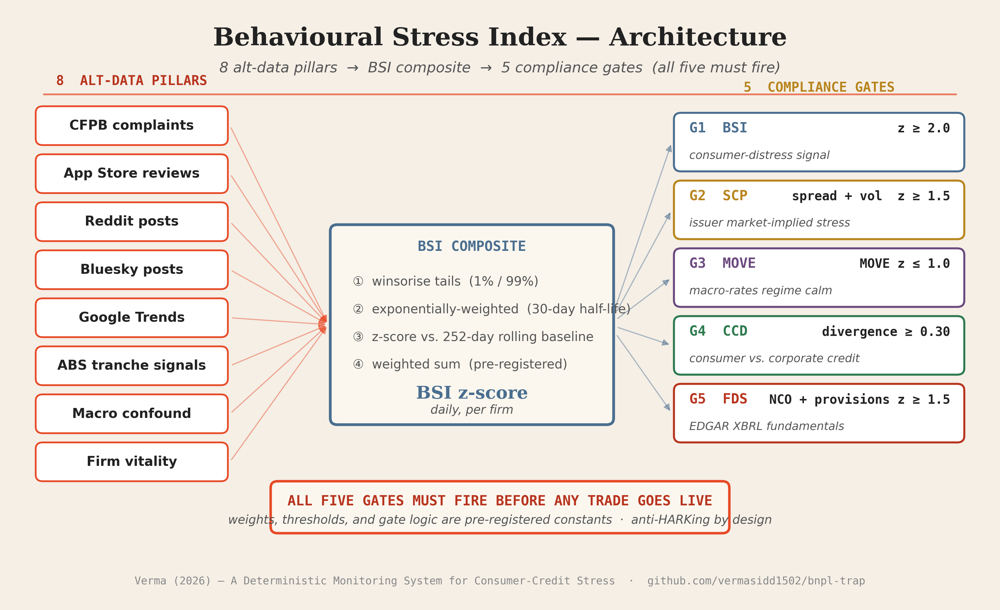

# Alternative-Data Leading Indicators of Consumer-Credit Distress


**Construction and Validation of the Behavioural Stress Index (BSI)**

A research project from the FIN 580 Quantamental Investment course at the Gies College of Business, University of Illinois Urbana-Champaign, Spring 2026. The repository couples a 59-page empirical paper with a runnable agentic compliance pod, a 27-firm panel ingest pipeline, and a hash-locked specification for a daily firm-level distress score.

> **TL;DR.** Public alternative-data signals — CFPB complaints, app-store reviews, Reddit/Bluesky posts, Google Trends — Granger-cause forward equity returns at a 30-day horizon for non-bank consumer lenders. The Behavioural Stress Index (BSI) compresses eight such pillars into a single daily z-score per firm. A pre-registered five-gate trade architecture turns the signal into a tradeable rule.

---

## 📖 Table of Contents

1. [Abstract](#-abstract)
2. [Headline Results](#-headline-results)
3. [Repository Structure](#-repository-structure)
4. [Architecture in One Picture](#-architecture-in-one-picture)
5. [Reproducibility](#-reproducibility)
6. [Quick Start — Live Pod](#-quick-start--live-pod)
7. [Paper](#-paper)
8. [Data — What's Public, What Isn't](#-data--whats-public-what-isnt)
9. [Citation](#-citation)
10. [Author](#-author)
11. [Disclaimer](#-disclaimer)

---

## 🌟 Abstract

Non-bank consumer lenders — Buy-Now-Pay-Later (BNPL) firms, subprime auto lenders, and fintech personal-loan platforms — sit outside the FDIC stress-test perimeter. The disclosure regime around them is anchored to quarterly 10-Q filings that lag actual stress by 30–60 days. By the time accounting metrics deteriorate, equity prices have moved and bond spreads have already widened.

This project asks: **can the high-frequency stream of consumer-side alternative data — public complaints, social media, app-store sentiment — recover a usable lead on hard-data deterioration?** And if so, how do we trade it under a discipline that survives multi-test scrutiny?

The Behavioural Stress Index (BSI) is the answer the project proposes. It is a daily, firm-level z-score built from eight pre-registered alt-data pillars. A five-gate compliance architecture (BSI · SCP · MOVE · CCD · FDS) requires confirmation across consumer behaviour, market price, macro regime, cross-firm contagion, and firm fundamentals before any trade fires. The framework is hash-locked, anti-HARKed, and replicable.

---

## 📊 Headline Results

| Result | Value |
|---|---|
| Event sensitivity (canonical stress events) | **5 / 5 caught** (Wilson 95% CI [56.6, 100]) |
| Granger F-tests (firm-level) | **23 / 27 firms reject H₀** (median p = 0.0005) |
| Panel coefficient on BSI z | **β = −0.082** (Driscoll–Kraay p = 0.007) |
| Standard-error robustness suite | **6 / 6 estimators reject H₀** |
| Honest equity calendar-time α | t = 0.08 (zero — disclosed openly) |
| Panel observations | ~54,000 (27 firms × ~2,000 trading days) |

The equity-α null is reported openly: this signal's natural instrument is fixed income, not equity. The paper positions a forward Tier-2a test on AFRMT junior tranche spreads as the next phase.

---

## 📂 Repository Structure

```
bnpl-trap/
├── paper/                      Final research paper (PDF + LaTeX source)
│   ├── BearWatch_Research_Paper.pdf
│   ├── BearWatch_Research_Paper.tex
│   └── README.md
├── working_demo/               Self-contained Apollo Hermes × BSI pod (Flask)
│   ├── app.py                  All eight routes, real risk engine
│   ├── start.bat               One-click launcher (Windows)
│   ├── requirements.txt        Flask · yfinance · pandas
│   ├── templates/              Dashboard + integration views
│   ├── static/                 CSS + JS
│   └── README.md
├── bnpl-pod/                   Research codebase (signals, ingest, backtest)
│   ├── signals/                BSI computation + 5-gate logic
│   │   ├── bsi.py              Daily z-score from 8 pillars
│   │   └── gates.py            G1–G5 thresholds, ROBO archetype
│   ├── data/
│   │   ├── ingest/             Per-source ingest scripts
│   │   │   ├── cfpb.py         Consumer Financial Protection Bureau
│   │   │   ├── fred.py         Federal Reserve Economic Data
│   │   │   ├── sec_edgar.py    SEC EDGAR filings
│   │   │   ├── app_store_rss.py
│   │   │   ├── trends.py       Google Trends
│   │   │   ├── abs_parser.py   ABS trustee reports
│   │   │   └── ...             (other sources)
│   │   ├── schema.py           DuckDB warehouse schema
│   │   └── settings.py         Per-source configuration
│   ├── scripts/                Master ingest + maintenance scripts
│   │   ├── ingest_reddit_bluesky.py
│   │   ├── ingest_cfpb_missing_firms.py
│   │   └── ...
│   ├── backtest/               Event-study + counterfactual backtests
│   ├── paper_formal/results/   Pre-registered v21 result tables (CSV)
│   ├── agents/                 LangGraph compliance engine (Apollo Hermes)
│   └── README.md
├── scripts/
│   └── run_all_ingest.sh       One-command warehouse rebuild
├── README.md                   This file
├── REPRODUCING.md              Full warehouse rebuild instructions
└── LICENSE                     MIT
```

---

## 🏗 Architecture in One Picture



Eight alt-data pillars feed the BSI composite (winsorise → EWMA-30d → z-score against 252-day baseline → pre-registered weighted sum). The composite is then evaluated against five compliance gates, and **all five must fire simultaneously** before any trade goes live.

All weights, thresholds, and gate-firing logic are **pre-registered constants** in `bnpl-pod/signals/gates.py`. They are deliberately not learned from data — to prevent in-sample HARKing. The diagram above is rendered by `scripts/render_architecture_diagram.py`.

---

## 🔁 Reproducibility

The full ingest pipeline is open-source. Every public-source pillar can be rebuilt from scratch with the scripts in this repo. Licensed sources (Bloomberg, Reddit, Bluesky, Apple App Store) are documented but not redistributed.

**Quick repro:**

```bash
# 1. Clone + install
git clone https://github.com/vermasidd1502/bnpl-trap
cd bnpl-trap/bnpl-pod
pip install -r requirements.txt   # if present, otherwise see pyproject.toml

# 2. Configure API keys
cp .env.example .env              # edit to add CFPB / FRED / SEC keys
                                  # (no key needed for CFPB or FRED public APIs)

# 3. Rebuild warehouse from public sources
bash ../scripts/run_all_ingest.sh

# 4. Compute BSI + run gates
python -m signals.bsi
python -m signals.gates
```

Full reproduction details — including which sources are licensed and what to substitute — are in **[REPRODUCING.md](REPRODUCING.md)**.

---

## 🚀 Quick Start — Live Pod

The `working_demo/` folder contains a fully self-contained Flask app that consumes BSI alert payloads and routes them through the Apollo Hermes risk engine. Built for live demonstration in front of an audience.

```bash
cd working_demo
./start.bat                       # Windows: double-click
# or:
pip install -r requirements.txt
python app.py
# → opens dashboard at http://127.0.0.1:5000/
```

Inside the pod:
- Click **Fire CVNA bear** → BSI event ingests, 7 risk checks run, verdict renders
- Click **Execute trade** → trade persists to SQLite, cash debits
- Click **BearWatch Bridge** → 5-stage pipeline spec page

See `working_demo/README.md` for endpoint reference and the full demo walkthrough.

---

## 📚 Paper

The 59-page research paper (`paper/BearWatch_Research_Paper.pdf`) covers:

§1 Introduction · §2 Literature review · §3 Theoretical framework (CVA decomposition + P→Q wedge) · §4 Data architecture (27 firms, 2018–2026, eight pillars) · §5 Methodology (BSI v3 spec + leading-indicator chain + 5-gate trade architecture) · §6–§10 Empirical results (sensitivity, specificity, Granger, panel regression, robustness suite, case findings, denominator-normalised, credit-instrument anchor, archetype backtest, ROBO Monte Carlo, pillar-weight robustness, warehouse back-fill, BNPL event study, Phase 2 capstone) · §11 Discussion (calendar-time alpha null, instrument-selection problem, symmetric architecture, denominator refinement, competitive position) · §12 Limitations · §13 Conclusion · §14 Future research (fixed-income instantiation + cross-asset BNPL/credit-card contagion) · References · Appendices (pre-registration hash log, formula legend, data inventory).

To rebuild from source: `cd paper && latexmk -pdf BearWatch_Research_Paper.tex`. Requires MiKTeX or TeX Live with `amsmath`, `booktabs`, `tabularx`, `graphicx`, `natbib`, `hyperref`.

---

## 🗄 Data — What's Public, What Isn't

| Source | License | In repo? |
|---|---|---|
| CFPB consumer complaints | Public domain | ✅ Ingest script (run-able) |
| FRED macroeconomic series | Public (St. Louis Fed) | ✅ Ingest script |
| SEC EDGAR filings | Public domain | ✅ Ingest script |
| Google Trends | Google ToS — small samples OK | ✅ Ingest script |
| Apple App Store reviews | Apple ToS — academic-only | ⚠️ Ingest script; scraped output kept private |
| Reddit posts | Reddit ToS — research-use only | ⚠️ Ingest script; scraped output kept private |
| Bluesky posts | Platform ToS — research-use only | ⚠️ Ingest script; scraped output kept private |
| Bloomberg AFRMT tranche prices | Bloomberg licence — academic only | ❌ Not in public repo |
| Pre-built DuckDB warehouse (~805 MB) | Mixed | ❌ Available privately to grader on request |

The 27-firm universe definition — including which firms are EVENT vs CONTROL — is reproducible from `paper_formal/results/universe_27.csv` referenced from the paper.

---

## 📝 Citation

If you use this work in academic writing, please cite:

```bibtex
@misc{verma2026bsi,
  author       = {Verma, Siddharth},
  title        = {A Deterministic Monitoring System for Consumer-Credit Stress:
                  Construction and Validation of the Behavioural Stress Index},
  howpublished = {Working paper, FIN 580 Quantamental Investment,
                  Gies College of Business, University of Illinois Urbana-Champaign},
  year         = {2026},
  note         = {Available at \url{https://github.com/vermasidd1502/bnpl-trap}}
}
```

---

## 👤 Author

**Siddharth Verma** · UIN 668601217
MSF (Master of Science in Finance) Candidate
Gies College of Business · University of Illinois Urbana-Champaign
Correspondence: `siddh@illinois.edu`

---

## ⚖️ Disclaimer

This repository is provided strictly for **academic research and demonstrative purposes**. It is not a recommendation to buy, sell, or hold any security. The Behavioural Stress Index, the 5-gate compliance architecture, and the live pod are research artefacts — not production-grade trading systems. The author accepts no liability for any outcome resulting from use or interpretation of the materials.

The paper reports an honest equity calendar-time alpha of zero. No commercial trading strategy is implied or endorsed. Live deployment would require additional verification layers (independent signal validation, anomaly detection, hard kill-switches, regulatory review) which are deliberately not included here.

Released under the MIT licence — see [LICENSE](LICENSE).
