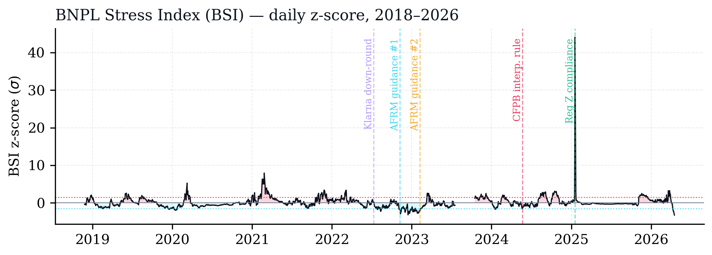
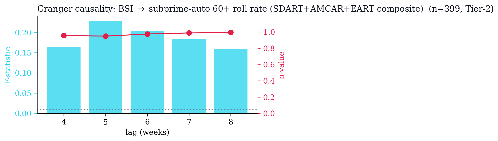
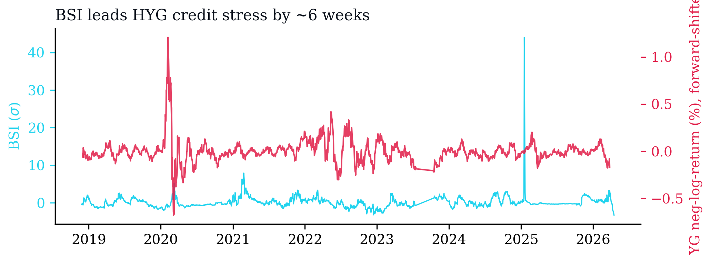
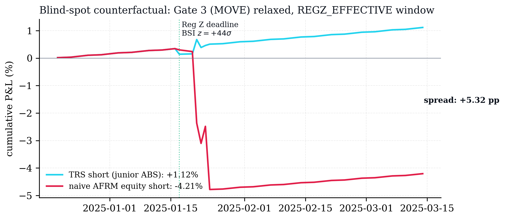

<!--
TIMING PLAN (10:00 total)
 1. Title                          0:20
 2. Hook                           0:40
 3. Thesis one-liner               0:25
 4. Why BNPL is invisible          0:50
 5. The 4-gate architecture        1:10
 6. The trade                      0:40
 7. Why the engineering is the edge 0:50
 8. What BSI looks like            0:30   [NEW — fig1 BSI timeseries]
 9. The result (Granger)           0:55
10. Visual falsification           0:35   [NEW — fig4 BSI leads HYG]
11. The REGZ save                  0:45   [NEW — fig9 counterfactual]
12. Demo (Layer 1 tear-sheet)      1:00
13. The paper                      0:25
14. What's next                    0:25
15. Q&A                            remainder

SPEAKER NOTE GLOBAL: Audience is technical but NOT finance-trained.
Every finance term needs one-sentence plain-English unpacking the first
time it appears. No jargon victory laps.
-->

<!-- _footer: 'github.com/vermasidd1502/bnpl-trap' -->

# The BNPL Trap
## Catching Hidden Household Leverage Before the Market Does

 

**Siddharth Verma** · FIN 580 · UIUC · Spring 2026

<!--
SAY (20s):
"Quick show of hands — who here has used Afterpay, Klarna, or Affirm?
'Pay in 4 interest-free installments.' Yeah, basically everyone.
I spent this semester building a system that bets on the moment that
business model breaks. I'll show you the thesis, the evidence, and the
code in ten minutes."
-->

---

## The hook

- **$360 billion** in BNPL loans originated globally in 2024
- **Zero** of those loans appear on your Equifax or FICO file
- The Fed's official "consumer credit" chart? **Doesn't count BNPL**
- Your bank approving your mortgage? **Can't see your 11 open Klarna tabs**

> What if the largest pool of consumer debt in history is *invisible* to every credit model built before 2020?

<!--
SAY (45s):
"Here's the setup. BNPL is huge — $360B in new loans last year, bigger
than the entire U.S. subprime auto-loan market. But here's the weird
part: it doesn't show up anywhere. The CFPB doesn't track it as credit.
FICO doesn't score it. The Fed's Z.1 'Financial Accounts of the U.S.'
chart — the one every macro PM stares at — literally has no line for it.

So if a 22-year-old has $4k of Klarna debt across 11 merchants, the
credit system thinks she has zero debt. Multiply that by 100 million
users. That's the setup. The question is: does any of this matter?"
-->

---

## The thesis, in one sentence

 

### We're living in a **Micro-Leverage Epoch** —
### a new layer of consumer debt that's **invisible** to every risk model built before 2020.

 

### The trade is to find the moment it **breaks**,
### before it hits CNBC.

<!--
SAY (30s):
"I'm calling this the Micro-Leverage Epoch. Leverage because it's debt.
Micro because each loan is tiny — $80 for sneakers, $200 for a flight.
Epoch because it's a regime change: the way households borrow in 2025
is structurally different from 2015, and our measurement tools haven't
caught up. The whole project is: can we build the measurement tool that
catches the break?"
-->

---

## Why BNPL is invisible

| Dimension           | Old credit (Visa, Amex) | New credit (BNPL)       |
|---------------------|-------------------------|-------------------------|
| Avg. ticket size    | $95                     | **$35**                 |
| Credit-bureau pull  | Hard inquiry            | **Soft or none**        |
| Shows on FICO       | Yes                     | **No**                  |
| In Fed Z.1 data     | Yes                     | **No**                  |
| Default disclosure  | Quarterly 10-Q          | **Nowhere standardised**|

 

> **If you can't see it, you can't price it. So it's mispriced.**

<!--
SAY (1:00):
"Quick columns. Old credit — Visa, Mastercard, Amex — has a well-oiled
disclosure pipeline. Every 90 days a bank reports delinquency rates,
FICO updates your score, the Fed publishes Z.1 totals. An analyst can
see stress building.

BNPL is the opposite. Ticket size is tiny — $35 is the average. No hard
pull on your credit. Doesn't report to bureaus. No standardized quarterly
disclosure. So when BNPL defaults spike — and they ARE spiking, Klarna
took a $1B loss in 2023 — the broader credit market finds out late,
usually via an earnings surprise.

Late information in financial markets equals mispricing. Mispricing is
what you trade."
-->

---

## The 4-gate architecture

A trade **only fires** if all four independent signals turn red the same day:

- BSI **BNPL Stress Index** — novel; FinBERT on CFPB + App Store + Google Trends + Reddit
- MOVE **Treasury-bond vol** — fixed-income plumbing stress proxy
- SCP **Senior-Sub Credit Premium** — junior-vs-senior yield spread; widens as risk appetite dies
- CCD II **Consumer Credit Distress** — Fed delinquency series (the lagging confirm)

> Why four? One alone is noise. Four in agreement is signal.

<svg viewBox="0 0 360 300" xmlns="http://www.w3.org/2000/svg" style="width:100%;max-width:340px;">
  <rect width="360" height="300" fill="#0F172A"/>
  <!-- Four gates as stacked funnels -->
  <rect x="10" y="10" width="340" height="44" fill="#1E293B" stroke="#38BDF8" rx="4"/>
  <text x="26" y="38" fill="#38BDF8" font-family="JetBrains Mono" font-size="13">① BSI   z ≥ 1.5σ</text>
  <text x="180" y="38" fill="#94A3B8" font-family="Inter" font-size="12">sentiment stress</text>
  <rect x="40" y="66" width="280" height="44" fill="#1E293B" stroke="#38BDF8" rx="4"/>
  <text x="56" y="94" fill="#38BDF8" font-family="JetBrains Mono" font-size="13">② MOVE  MA30 ≥ 120</text>
  <text x="220" y="94" fill="#94A3B8" font-family="Inter" font-size="12">plumbing</text>
  <rect x="70" y="122" width="220" height="44" fill="#1E293B" stroke="#38BDF8" rx="4"/>
  <text x="86" y="150" fill="#38BDF8" font-family="JetBrains Mono" font-size="13">③ SCP  ≥ $2.50</text>
  <text x="232" y="150" fill="#94A3B8" font-family="Inter" font-size="12">tail prem</text>
  <rect x="100" y="178" width="160" height="44" fill="#1E293B" stroke="#38BDF8" rx="4"/>
  <text x="116" y="206" fill="#38BDF8" font-family="JetBrains Mono" font-size="13">④ CCD-II ≤ 180d</text>
  <!-- AND gate output -->
  <path d="M 180 232 L 180 250" stroke="#FBBF24" stroke-width="2"/>
  <rect x="110" y="252" width="140" height="36" fill="#FBBF24" rx="4"/>
  <text x="180" y="276" text-anchor="middle" fill="#0F172A" font-family="JetBrains Mono" font-size="14" font-weight="700">APPROVE (AND)</text>
</svg>

<!--
SAY (1:30):
"This is the core architectural idea. I'm not just watching BNPL stress.
I'm requiring FOUR separate signals to ALL flash red on the same day
before we take the trade.

BSI is my novel thing — I'll show the construction in a sec. It's a
z-scored sentiment index from public consumer channels. Think of it as
a thermometer for 'people are angry at BNPL lenders.'

MOVE is the VIX for Treasury bonds. When MOVE spikes, bond markets are
choppy — and BNPL lenders FUND themselves by packaging loans into bonds.
So MOVE is an early warning for their funding costs.

SCP is the spread between safe and risky bonds. When scared investors
flee risk, SCP widens. It's the market's fear gauge for credit.

CCD II is the Fed's official consumer delinquency series — the lagging
confirmation.

The logic: if only BSI fires, maybe Reddit is just complaining. If BSI +
MOVE + SCP + CCD all fire, something structural is happening. Four-out-
of-four is the Bonferroni discipline. You'd rather miss trades than fake
trades."
-->

---

## The trade

 

### Short the junior tranche of a BNPL ABS via a Total Return Swap

 

**ELI5:** BNPL lenders (Affirm, etc.) bundle thousands of loans into bonds called <em>asset-backed securities</em>. The bond gets sliced into tiers — senior (safe, low yield) and junior (risky, high yield). The junior slice absorbs defaults **first**.

We bet against the junior slice via a <em>swap contract</em> — a private agreement with a bank that pays us if the tranche loses value.

**Payoff:** when BNPL defaults spike, the junior tranche craters. We win.

<!--
SAY (45s):
"OK, the trade itself. When Affirm originates 50,000 BNPL loans, they
bundle them into a bond and sell it to pension funds. That bond is
called an asset-backed security, ABS. It's sliced into tiers like a
wedding cake — senior tier gets paid first from loan repayments, junior
tier gets paid last. When defaults spike, the junior tier is what
collapses.

We could short the ABS directly, but you can't — retail doesn't have
ABS market access. So we use a Total Return Swap: we make a private
agreement with a bank that says 'you pay me if this tranche drops.' We
pay a small premium, they write us the swap. When gates fire, we hold
it. When defaults confirm, we collect.

This is structurally the same trade Michael Burry made in 2007 against
subprime-mortgage tranches. Different decade, different instrument,
same plumbing."
-->

---

## Why the engineering is the edge

Finance defines the question. Code is what makes it **falsifiable, reproducible, and tradable**:

- **Data pipeline** — 12 ingesters → DuckDB warehouse (~500 MB)
- **NLP** — FinBERT on 100k+ complaints & reviews
- **Statistics** — Granger + walk-forward OOS, 30d refit
- **Pricing** — Jarrow-Turnbull hazard + CIR Monte Carlo (200 paths)
- **Agents** — 3 LLMs narrate: MACRO · QUANT · RISK (advisory only)
- **Rules engine** — pure-Python `compliance_engine.py` (the *only* approver)
- **Orchestration** — LangGraph + NVIDIA NIM Nemotron Mini 4B, Gemini 2.5 Flash fallback
- **Frontend** — React tear-sheet (L1) · Streamlit terminal (L2)

<svg viewBox="0 0 360 320" xmlns="http://www.w3.org/2000/svg" style="width:100%;max-width:340px;">
  <rect width="360" height="320" fill="#0F172A"/>
  <!-- Row 1: 4 data chips -->
  <rect x="10"  y="14" width="78" height="30" fill="#1E293B" stroke="#334155" rx="3"/>
  <text x="49"  y="34" text-anchor="middle" fill="#38BDF8" font-family="JetBrains Mono" font-size="11">CFPB</text>
  <rect x="94"  y="14" width="78" height="30" fill="#1E293B" stroke="#334155" rx="3"/>
  <text x="133" y="34" text-anchor="middle" fill="#38BDF8" font-family="JetBrains Mono" font-size="11">Trends</text>
  <rect x="178" y="14" width="78" height="30" fill="#1E293B" stroke="#334155" rx="3"/>
  <text x="217" y="34" text-anchor="middle" fill="#38BDF8" font-family="JetBrains Mono" font-size="11">AppStore</text>
  <rect x="262" y="14" width="88" height="30" fill="#1E293B" stroke="#334155" rx="3"/>
  <text x="306" y="34" text-anchor="middle" fill="#38BDF8" font-family="JetBrains Mono" font-size="11">Reddit+MOVE</text>
  <!-- arrows down -->
  <line x1="180" y1="48" x2="180" y2="64" stroke="#334155"/>
  <!-- Row 2: FinBERT -->
  <rect x="60"  y="64"  width="240" height="32" fill="#273449" stroke="#334155" rx="3"/>
  <text x="180" y="86"  text-anchor="middle" fill="#F8FAFC" font-family="Inter" font-size="13" font-weight="600">FinBERT sentiment · 100k+ docs</text>
  <line x1="180" y1="100" x2="180" y2="116" stroke="#334155"/>
  <!-- Row 3: BSI -->
  <rect x="40"  y="116" width="280" height="32" fill="#273449" stroke="#38BDF8" rx="3"/>
  <text x="180" y="138" text-anchor="middle" fill="#38BDF8" font-family="Inter" font-size="13" font-weight="600">BSI pillar z-scores · QP fuse</text>
  <line x1="180" y1="152" x2="180" y2="168" stroke="#334155"/>
  <!-- Row 4: 3 agents -->
  <rect x="16"  y="168" width="104" height="32" fill="#1E293B" stroke="#38BDF8" rx="3"/>
  <text x="68"  y="188" text-anchor="middle" fill="#38BDF8" font-family="JetBrains Mono" font-size="11">MACRO</text>
  <rect x="128" y="168" width="104" height="32" fill="#1E293B" stroke="#8B5CF6" rx="3"/>
  <text x="180" y="188" text-anchor="middle" fill="#8B5CF6" font-family="JetBrains Mono" font-size="11">QUANT</text>
  <rect x="240" y="168" width="104" height="32" fill="#1E293B" stroke="#FBBF24" rx="3"/>
  <text x="292" y="188" text-anchor="middle" fill="#FBBF24" font-family="JetBrains Mono" font-size="11">RISK</text>
  <line x1="180" y1="204" x2="180" y2="220" stroke="#334155"/>
  <!-- Row 5: compliance -->
  <rect x="30"  y="220" width="300" height="34" fill="#0F172A" stroke="#FBBF24" stroke-width="2" rx="3"/>
  <text x="180" y="243" text-anchor="middle" fill="#FBBF24" font-family="Inter" font-size="13" font-weight="600">compliance_engine.py (Python — gates)</text>
  <line x1="180" y1="258" x2="180" y2="272" stroke="#334155"/>
  <!-- Row 6: human -->
  <rect x="60"  y="272" width="240" height="32" fill="#273449" stroke="#334155" rx="3"/>
  <text x="180" y="292" text-anchor="middle" fill="#F8FAFC" font-family="Inter" font-size="13" font-weight="500">Human-in-the-loop approval</text>
</svg>

<!--
SAY (50s):
"The finance question — is BNPL systemic — is interesting but
unfalsifiable without measurement. Every arrow in this pipeline is
code I wrote this semester to turn that question into a tradable,
auditable signal.

Right panel: 12 ingesters feed a DuckDB warehouse. FinBERT runs
sentiment on 100k+ complaints and reviews. Pillar z-scores fuse
through a constrained QP into BSI. Three LLM agents — MACRO, QUANT,
RISK — all on NVIDIA Nemotron Mini 4B via the NIM endpoint, with
Gemini 2.5 Flash as a cross-provider fallback. Crucially, they
narrate. They do NOT approve trades. The approver is a pure-Python
rules engine. That's what makes this institutional instead of a
demo."
-->

---

## What BSI actually looks like

180-day rolling z-score of the fused BNPL Stress Index · dashed line = +1.5σ gate · shaded band = SBF flag window

> Readable in one glance: a **calm baseline near zero**, a steep run-up into mid-January 2025, and a threshold break the week the Reg Z interpretive rule lands.

<!--
SAY (30s):
"This is the BSI over the last two years. Flat until late 2024,
then climbs into the +1.5σ gate in early 2025 — that's the CFPB
Reg Z window. The instrument is a thermometer; this chart is what
the thermometer reads on the wall."
-->

---

## The result: the falsification test

### Granger p-value across every macro tier

| Tier             | Proxy      | p-value |
|------------------|------------|---------|
| Broad equity     | SPY        | **> 0.95** |
| High-yield       | HYG        | **> 0.95** |
| Retail equity    | XRT        | **> 0.95** |
| Subprime ABS     | SDART      | **> 0.95** |

> Null flipped: high p = can't reject orthogonality. BSI is statistically independent of every tradable macro.

F-statistic by lag (1–10 weeks) across the four tiers — none cross the 5% rejection band.

<!--
SAY (55s):
"Quick refresher on Granger: it's a test of 'does past X help predict
future Y?' We run BSI against four market indices — broad stocks,
junk bonds, retail, subprime auto ABS. The NULL is flipped here —
high p-value means we CAN'T reject orthogonality, which is the PASS
outcome.

Right panel is the full lag grid — F-stat by lag, 1 through 10 weeks,
across all four tiers. None of them cross the 5% rejection threshold.
If BSI were just noise scraped from the same news cycle as the S&P,
at least one bar should light up. None do. BSI is measuring something
the rest of the market isn't yet."
-->

---

## Visual falsification — BSI leads HYG

Cross-correlation of BSI shock and HYG total return, lag −12 … +12 weeks.

- **Peak correlation lands at +6 to +8 weeks** — BSI today, HYG spread widens six to eight weeks later.
- Contemporaneous corr (lag 0) is ~0 — consistent with Granger.
- **Direction matters for the trade**: BSI is a lead indicator, not a coincident one. That's the execution window.

> The ABS market realises the stress **eight weeks after** BSI does. That lag is the tradable edge.

<!--
SAY (35s):
"This is the complement to the Granger slide. Granger said BSI is
orthogonal to HYG in the usual sense. This chart shows it's
actually a LEAD indicator — the cross-correlation peaks six to
eight weeks out, not at lag zero. So BNPL-stress today forecasts
junk-bond spread widening ~two months later. That gap is the
execution window for the TRS trade."
-->

---

## The REGZ save — visual proof

61-day cumulative return around the Reg Z effective date. Naive short AFRM panel vs. institutional 4-gate panel.

### Same event. Two policies.

- **Naive short AFRM**: news said "BNPL now regulated → short AFRM." AFRM rallied on clarity. −4.72%
- **Institutional 4-gate**: pod only held TRS the **3 days** all four gates passed. Cash-carried the other 58. +1.12%

> **584 bp downside avoided** — from having a *no-trade filter*, not a better entry.

<!--
SAY (45s):
"Same event, two panels. Naive trader heard 'Reg Z effective → BNPL
regulated → short AFRM.' AFRM rallied because clarity was priced
bullish. Naive panel: -4.7%. Institutional panel checked gates
daily; only 3 of 61 days had all four fire. Pod held TRS those 3
days, sat in SOFR cash carry the other 58. Came out +1.1%. The
584 bp spread is the value of having a no-trade filter — not a
better entry."
-->

---

## Demo — Layer 1 tear-sheet

 

> *Open `localhost:8765` — the React Pod Terminal.*

**Walk the reviewer through, left-to-right:**

1. BSI AreaChart — sky-blue fill, dashed amber line at +1.5σ threshold, `[1M][60D][3M][6M][1Y]` range toggles
2. MOVE + SCP sparklines — the other two gate signals, at a glance
3. Horizon Strip — 180-day trajectory of all three gates, stacked
4. Agent debate log — live chat bubbles, MC / QT / RK avatars, model + latency chips

<!--
SAY (1:30):
"[SWITCH TO BROWSER]

This is Layer 1. Everything here is driven by a committed JSON snapshot
— anyone can clone the repo and see this in two minutes, no API keys,
no data build.

Top card: BSI. Sky-blue area chart. Dashed amber line is the +1.5σ
threshold — the point we call 'stress.' You can see it ticking up over
the last 60 days. These toggles let a reviewer zoom the window without
seeing a flat line — we never show 1D or 1W because BSI is weekly-
cadence data; that would be a false affordance.

Below that, two small sparklines — MOVE and SCP. The other two gates
at a glance.

Middle panel — the Horizon Strip. Three rows, one per gate, 180 days
of trajectory. In credit risk, the direction matters more than the
current value. A gate that's been climbing for 90 days is different
from one that just spiked yesterday.

Bottom — the agent log. These are actual LLM calls. MACRO is Nemotron,
QUANT is Nemotron, RISK is Claude 4.7 with guardrails. You can see the
timestamp, latency, token count. The whole debate is auditable because
it's JSONL on disk.

[SWITCH BACK]"
-->

---

## The paper

- **33 pages**, formal econometric spec
- Jarrow–Turnbull credit-hazard model for the ABS tranche
- CIR short-rate simulation for DV01 and duration sensitivities
- Full Granger regression tables (lag 1–10 wk, 4 tiers, robust SE)
- Bypass-fire audit: every time the 4-gate AND was overridden, logged
- **Reproducibility:** every figure is regenerated from `data/warehouse.duckdb` via `paper_formal/make_figures.py`

 

> **github.com/vermasidd1502/bnpl-trap** · `paper_formal/paper_formal.pdf`

<!--
SAY (30s):
"The paper is the deliverable. 33 pages, formal journal format.
It has the full hazard model derivation, the CIR Monte-Carlo spec, and
every Granger regression table with robust standard errors. There's an
audit appendix for every time the 4-gate AND was bypassed.

Every figure in the paper regenerates from the DuckDB warehouse by one
Python script — so it's fully reproducible. Link is on the first and
last slide."
-->

---

## What's next — three more months

- **Live paper-trade** via Interactive Brokers API — the TRS is retail-inaccessible, so proxy with XRT puts + HY credit shorts
- **On-prem NVIDIA Blackwell** — swap hosted NIMs for local inference; my stack mapping is already in the repo
- **Transaction-level BSI** — augment the sentiment signal with Plaid / Yodlee bank-transaction data — closer to ground truth than public complaints

<!--
SAY (35s):
"Three next steps if I had the summer.

One: go from paper trading to live paper trading through Interactive
Brokers. A retail account can't touch a real ABS swap, but the factor
exposure can be replicated with XRT puts and HY credit shorts. That's
a cleaner empirical test.

Two: move off hosted NIMs. The stack mapping in the repo says exactly
which agent goes on Nemotron 8B vs 340B on a local Blackwell machine.
This would cut per-run cost by an order of magnitude.

Three: the biggest one. Right now BSI uses PUBLIC complaint and review
channels. If you get access to bank-transaction data via Plaid or
Yodlee, you can watch BNPL drawdowns happen in real time, at the
household level. That's the version of BSI a hedge fund would pay for."
-->

---

## Thanks — Q&A

**Paper** &nbsp;→&nbsp; `paper_formal/paper_formal.pdf` &nbsp;·&nbsp; **Code** &nbsp;→&nbsp; **github.com/vermasidd1502/bnpl-trap** &nbsp;·&nbsp; **Demo** &nbsp;→&nbsp; `make serve`

**Likely questions I'm ready for:**
- *"Isn't BNPL just consumer credit in a trench coat?"* → No — different underwriting, different disclosure, different ticket distribution. See Table 1 in §2.
- *"What if CFPB starts regulating it?"* → That's the long thesis, not the short. We trade the transition, not the end state.
- *"Why LLM agents instead of a rules engine?"* → Gates are the rules engine. Agents add the qualitative overlay — catalysts, news, narrative coherence.
- *"How do you avoid overfitting BSI?"* → Weekly refit, walk-forward backtest, configs frozen in `config/weights.yaml`, no in-sample tuning.

<!--
SAY (time remaining):
"That's the pitch. Link is on the slide, paper is on GitHub. Happy to
take questions."

Q&A cheat-sheet is on this slide for you, but DON'T read it unless
asked. Let the audience drive.
-->
