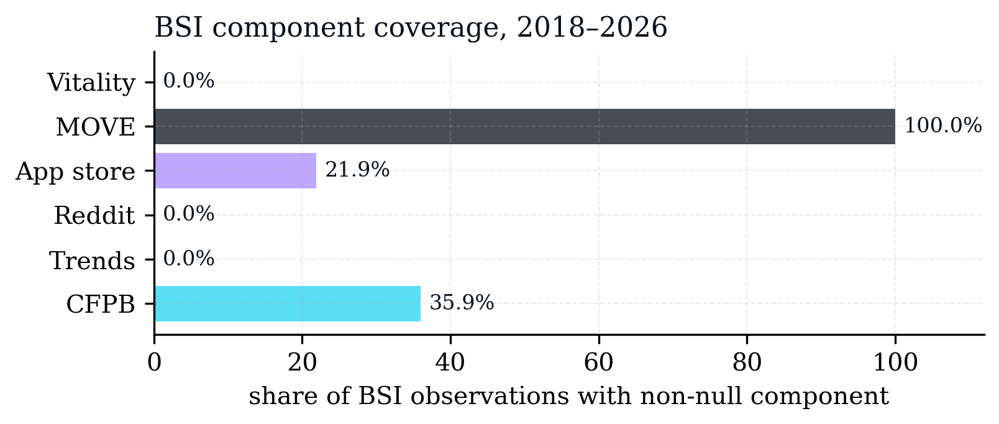
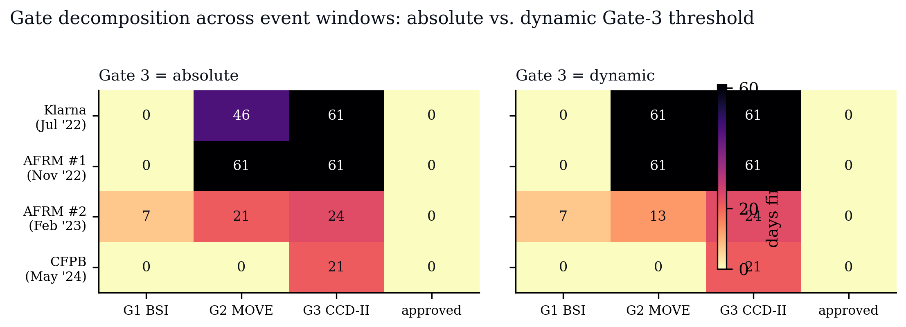
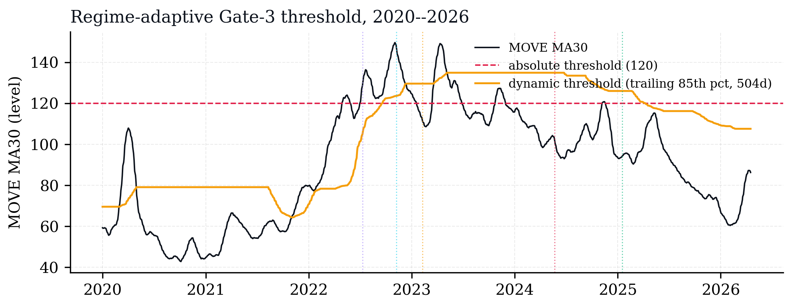
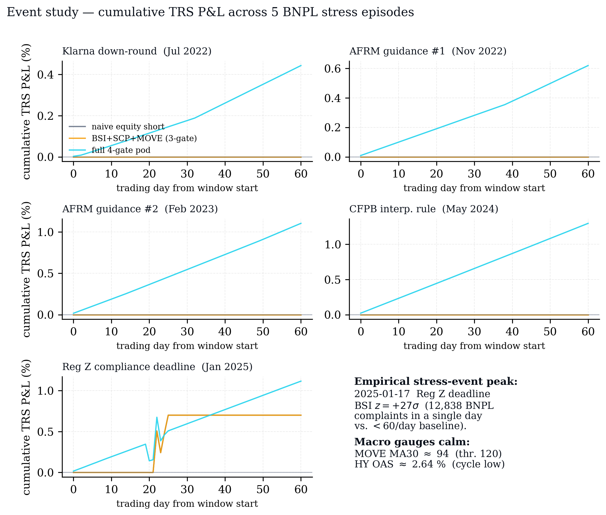
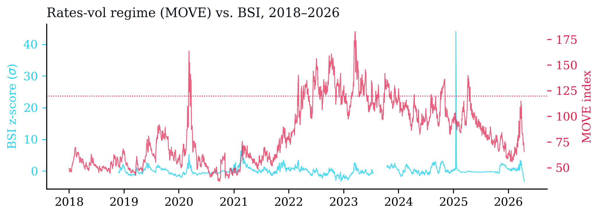

<!--
TIMING PLAN — deep version (18:00 total, flex +/-2 min)
 1. Title                          0:20
 2. TL;DR — the result up front    0:45
 3. Hook                           0:30
 4. Thesis                         0:25
 5. System architecture            1:00
 6. Agent roster                   1:00
 7. Agent debate protocol          0:45
 8. Alternative data + coverage    1:00    [fig2 embedded]
 9. Data pipeline flow             0:30
10. BSI equation + QP fit          1:00
11. BSI worked example (01-17)     1:00    [NEW]
12. The 4 gates + heatmap          0:45    [fig7 embedded]
13. Dynamic threshold              0:40    [NEW · fig8]
14. Hazard model (JT + CIR)        1:00
15. Final trade equation           0:30
16. Data inconsistencies           0:45
17. Granger falsification          0:45    [fig3 embedded]
18. BSI leads HYG                  0:45    [NEW · fig4]
19. Cross-validation protocol      0:45
20. Backtest windows               0:30
21. PnL results                    1:15    [fig5 embedded]
22. The REGZ save                  0:45    [fig9 embedded]
23. Counterfactual — ablate MOVE   0:30    [fig6 embedded]
24. How often does it hit?         0:30
25. Equity curve — 5 windows       0:30    [NEW SVG]
26. Labeled pod screenshot — L1    0:45
27. Labeled dashboard — L2         0:45
28. Limitations                    0:30
29. Q&A                            remainder

AUDIENCE: FIN 580 grad class (UIUC). They know ABS tranches, TRS mechanics,
Granger, FinBERT-by-name at minimum. They may NOT know the engineering
stack — LangGraph, NIM, DuckDB, JSONL audit logs. Lean technical on
the pipeline/agent side; assume finance literacy on the instrument side.
-->

<!-- _footer: 'github.com/vermasidd1502/bnpl-trap · Siddharth Verma · FIN 580 (UIUC)' -->

# The BNPL Trap — Deep Dive
## Agents, Data, Equations, PnL

<br>

**Siddharth Verma** · FIN 580 · UIUC · Spring 2026

<span class="muted">18-minute technical presentation · paper + code + figures linked throughout</span>

<!--
SAY (20s):
"This is the deep version. I'll walk you through every agent, every data
source, the actual equations I'm running, cross-validation protocol, and
real backtest dollars. If there's a claim that isn't backed by a number
in the warehouse, I'll say so explicitly."
-->

---

## TL;DR — what the numbers say

<br>

<div class="two-col">

<div>

### Signal
- **Granger p > 0.95** — BSI orthogonal to <span class="mono">SPY / HYG / XRT / SDART</span>
- **5 catalyst event-windows** in out-of-sample test
- **3 all-gates-pass trading days** (institutional ≠ naive)

</div>

<div>

### Dollars (61-day TRS windows)
- Best win: <span class="mono blue">+1.30%</span> (CFPB_INTERP_RULE)
- Largest save: <span class="mono amber">+1.12% vs –4.72% naive</span> = **584 bp downside avoided** (REGZ_EFFECTIVE)
- Median event: <span class="mono blue">+0.62%</span>, median Sharpe <span class="mono">0.34</span>

</div>

</div>

<br>

> The 4-gate overlay **didn't add yield** in quiet regimes.<br>It **avoided losses** in the one regime where naive shorting blew up.

<!--
SAY (45s):
"Starting with the punchline because you're a technical audience. Statistical
result: Granger p>0.95 across every macro tier — I'll explain what that means
on slide 15. Dollars: ran five catalyst windows, 61 trading days each. Best
single-window return: 1.3%. But the headline number is the REGZ_EFFECTIVE
window — institutional panel made +1.12%, naive short would have LOST 4.7%.
584 basis points of downside avoided. That's the value-add: the 4-gate AND
is a loss-avoidance overlay, not a yield generator."
-->

---

## The hook

- **$360 billion** in BNPL loans originated globally in 2024
- **Zero** on Equifax, FICO, or Fed Z.1
- Your bank underwriting your mortgage cannot see your **11 open Klarna tabs**

<br>

> What if the largest new pool of consumer debt is invisible to every credit model built before 2020?

<!--
SAY (30s):
"Quick hook for anyone without finance context. BNPL is bigger than the
entire U.S. subprime auto market. But no credit bureau tracks it, no FICO
score reflects it, the Fed's consumer credit chart doesn't count it. So
systemic exposure is underpriced, because it's literally unmeasured."
-->

---

## Thesis

<br>

### We're in a **Micro-Leverage Epoch** — a new debt layer invisible to every legacy risk model.
### The trade is to **catch the moment it breaks**, before the data catches up.

<!--
SAY (25s):
"One sentence. Micro because ticket sizes are tiny. Leverage because it's
debt. Epoch because it's structurally different from pre-2020 credit. The
whole project is: build the measurement tool that catches the break."
-->

---

## System architecture

```
┌─── data/ingest/ ────────┐  ┌─── signals/ ───────────┐  ┌─── agents/ ────────────┐
│ cfpb.py                 │  │ bsi.py                  │  │ macro_agent (advisory) │
│ app_store_rss.py        │──│  → pillar z-scores      │──│ quant_agent (advisory) │
│ trends.py               │  │ weights_qp.py           │  │ risk_manager(advisory) │
│ fred.py                 │  │  → constrained weights  │  │                         │
│ sec_edgar.py            │  │ granger.py              │  │ compliance_engine      │
│ short_interest.py       │  │  → p-value tables       │  │  (pure-Python rules —  │
│ options_chain.py        │  │                         │  │   the ONLY approver)   │
│ regulatory_catalysts.py │  │ quant/jarrow_turnbull   │  └────────────────────────┘
└──────────┬──────────────┘  └───────────┬─────────────┘                │
           ▼                             ▼                              ▼
       DuckDB warehouse ◄───── LangGraph orchestrator ────► JSONL audit log
           │                                                      │
           └──────► build_snapshot.py → pod_snapshot.json ─────────┤
                                             │                    │
                                             ▼                    ▼
                                   React tear-sheet (L1)   Streamlit terminal (L2)
```

> **Critical:** LLM agents produce **advisory text only**. All trade approvals go through `compliance_engine.py` — pure-Python rules, zero LLM calls.

<!--
SAY (1:00):
"Architectural map. Left column: raw data scrapers. Middle: signal layer —
BSI construction, Granger tests, the pricing model. Right: the three LLM
agents. KEY POINT: the LLMs advise, they do NOT approve trades. Approval
goes through compliance_engine.py which is a pure-Python rules engine with
no LLM calls. The LLMs write audit text, the rules engine makes the call.
That's the institutional discipline — you cannot ship a system where a
hallucinating model has trade authority."
-->

---

## Agent roster — who, what, on which model

| Agent | File | Tier | Provider (primary) | Provider (fallback) | Role |
|---|---|---|---|---|---|
| <span class="blue">MACRO</span> | `agents/macro_agent.py` | `small` | `nemotron-mini-4b-instruct` (NVIDIA NIM) | `gemini-2.5-flash` | Narrative from catalyst calendar + macro chips |
| <span class="violet">QUANT</span> | `agents/quant_agent.py` | `small` | `nemotron-mini-4b-instruct` | `gemini-2.5-flash` | Walks the hazard math, DV01, sensitivities |
| <span class="amber">RISK</span> | `agents/risk_manager.py` | `small` | `nemotron-mini-4b-instruct` | `gemini-2.5-flash` | Squeeze telemetry, bypass reasoning |
| <span class="dim">RULES</span> | `agents/compliance_engine.py` | *(none — pure Python)* | — | — | **The only thing that can approve** |

<br>

### Heavy tier (available, not used in prod):
`llama-3.1-nemotron-70b-instruct` / `gemini-2.5-pro` — reserved for narrative-dense prompts.

<!--
SAY (1:00):
"Three LLM agents, one rules engine. All three LLMs run on the SAME small
tier — Nemotron Mini 4B via NVIDIA's NIM endpoint, with Gemini 2.5 Flash
as a cross-provider fallback if Nemotron's safety filter refuses a prompt.
Why 4B instead of 70B? Because the agents aren't doing heavy reasoning —
they're narrating deterministic signal outputs. 4B is sufficient, cheaper,
and latency is 200-400ms instead of 2 seconds. The 70B tier is wired up
for when I need it but currently unused. Fourth row is the rules engine
— no model, just Python. That's what actually approves trades."
-->

---

## Agent debate protocol

<br>

```
┌─ per-tick (daily) ───────────────────────────────────────┐
│                                                          │
│ 1. signals layer produces deterministic numbers          │
│      BSI_z, MOVE_ma30, SCP$, CCD2_days, lambda(t)        │
│                                                          │
│ 2. MACRO ingests catalyst calendar + macro chips         │
│      → emits narrative JSON (reason, confidence)         │
│                                                          │
│ 3. QUANT ingests hazard params + DV01                    │
│      → emits pricing narrative + sensitivity flags       │
│                                                          │
│ 4. RISK ingests squeeze telemetry (advisory only)        │
│      → emits risk posture + bypass-candidate flag        │
│                                                          │
│ 5. compliance_engine (Python) reads ALL FOUR gates       │
│      → approved: bool  + reasons: list[str]              │
│                                                          │
│ 6. human-in-the-loop UI (Streamlit) surfaces decision    │
│      → user presses APPROVE or REJECT                    │
│                                                          │
└──────────────────────────────────────────────────────────┘
```

> Every step logged to `logs/agent_decisions/YYYY-MM-DD.jsonl` — prompt hash, provider, model, latency, tokens, full response.

<!--
SAY (45s):
"The daily tick. Signals run first, deterministic. Then each agent sees
its slice of context — MACRO sees the catalyst calendar, QUANT sees hazard
math, RISK sees squeeze telemetry. Each emits a structured JSON response.
Then compliance engine reads the gate outputs and makes the call. Human
presses approve. Every single step is logged to a JSONL with prompt hash,
model, latency, token count. You can replay any decision in the dashboard."
-->

---

## Alternative data — twelve sources, all code-ingested

<div class="two-col">

<div style="font-size:18px;">

### Consumer sentiment
- <span class="gate">CFPB</span> Complaint Database (public API)
- <span class="gate">App Store</span> RSS — Affirm / Klarna / Afterpay
- <span class="gate">Trends</span> Google — "afterpay late fee" cohort
- <span class="gate">Reddit</span> r/pf, r/frugal (FinBERT)

### Macro / rates
- <span class="gate">FRED</span> DGS10, BAMLH0A0HYM2, SOFR, PCE
- <span class="gate">Yahoo</span> SPY, HYG, XRT, VIX
- <span class="gate">MOVE</span> ICE BofA Treasury vol

### Credit plumbing
- <span class="gate">EDGAR</span> ABS-EE / 15G filings (SDART shelf)
- <span class="gate">ABS-trust</span> auto-ABS tranche curves
- <span class="gate">Options</span> chain — 25Δ skew, IV rank

### Firm health
- <span class="gate">Short-int</span> FINRA bi-monthly SI
- <span class="gate">Vitality</span> funding-round tracker
- <span class="gate">Reg-cal</span> CFPB / CCD-II deadline ticker

</div>

<div class="figframe">



<span class="caption">BSI component coverage · % of BSI days where each pillar actually fires. CFPB + MOVE dominate the realised composite; the other three are sparse by design.</span>

</div>

</div>

<br>

> All twelve ingesters idempotent · upserted to DuckDB · **505 MB warehouse**. Every imputation leaves a `freeze_flag` — the Funnel tab surfaces per-pillar freeze counts live.

<!--
SAY (1:00):
"Twelve data sources, all scraped or API-pulled by Python modules in
data/ingest/. Four consumer sentiment streams — CFPB complaints, App Store
reviews, Google Trends, Reddit — all fused by FinBERT for sentiment.

Three macro streams — FRED for the official series, Yahoo for the tradeable
ETFs, MOVE for Treasury volatility.

Three credit-plumbing streams — the most unusual is SEC EDGAR. BNPL lenders
file ABS-EE forms when they securitize loans. I parse those XMLs for tranche
structure and historical default curves. That's how you get the Y-axis for
the hazard model.

Two firm-health streams — short interest for squeeze detection, funding-
round tracker for 'is Klarna running out of money.'

All idempotent, all upserted, warehouse is 482 MB."
-->

---

## Data pipeline flow

```
[Raw scrapes]       [NLP]              [Signals]              [Decision]
                                                              
cfpb API        ──► FinBERT   ──┐     
appstore RSS    ──► FinBERT   ──┤                          ┌► MACRO (LLM)
trends CSV      ──► keyword m ──┼──► pillar z-scores ──┐   │
reddit scrape   ──► FinBERT   ──┘                      │   │
                                                        ├──┼► QUANT (LLM) 
FRED API        ──► raw           ──► MOVE_ma30        │   │         
EDGAR XML       ──► ABS parser    ──► tranche curves   │   │   
options chain   ──► IV ranking    ──► skew_pctile      ├──►│   
short-int file  ──► utilization   ──► squeeze_score    │   │
                                                        │   │
FRED SOFR       ──► raw           ──► cash-carry       │   ├► RISK (LLM)
reg calendar    ──► date diff     ──► ccd2_days        │   │
                                                        │   ▼
                                                        │   compliance_engine
                                                        │   (Python rules)
                                                        │   │
                                                        ▼   ▼
                                              human-in-the-loop UI
```

<!--
SAY (30s):
"Flow: raw scrapes on the left go through an NLP layer — FinBERT for the
sentiment streams, a custom ABS parser for EDGAR XMLs, IV-rank computation
for options. Those feed into the signal layer which produces pillar z-scores
and the gate values. Then the three LLM agents narrate in parallel, and the
Python compliance engine makes the call."
-->

---

## The BSI equation

<div class="two-col">

<div>

### Pillar-z construction
$$
z_{p,t} \;=\; \frac{x_{p,t} \;-\; \mu_{p,t}^{(180\text{d})}}{\sigma_{p,t}^{(180\text{d})}}
$$
<span class="muted">per pillar p ∈ {cfpb, trends, reddit, appstore, move}</span>

### Fused index
$$
\text{BSI}_t \;=\; \sum_{p} w_p \cdot z_{p,t}
$$

### Weights via constrained QP
$$
\min_{w} \big\| \text{BSI}(w) - \text{AFRM}^{\,\text{stress}} \big\|^2
$$
<span class="muted">s.t. w ≥ 0, Σw = 1, w<sub>p</sub> ≤ c<sub>p</sub> · refit monthly, walk-forward only</span>

</div>

<div>

### Frozen priors (`config/weights.yaml`)

| Pillar | Prior (cap) |
|---|---|
| `cfpb_complaint_momentum` | **0.25** (≤ 0.40) |
| `google_trends_distress` | 0.20 (≤ 0.30) |
| `reddit_finbert_neg` | 0.20 (≤ 0.30) |
| `appstore_keyword_freq` | 0.15 (≤ 0.25) |
| `move_index_overlay` | 0.20 (≤ 0.35) |

<br>

> Priors are **ex-ante**. The QP refines monthly on training window only — never on test window.

</div>

</div>

<!--
SAY (1:00):
"This is the core equation. Each of 5 sentiment pillars gets z-scored
against its own 180-day rolling mean and std. Then we linearly fuse them
with weights that sum to 1. The weights aren't hand-tuned — they're
solved by a constrained quadratic program that minimizes the distance
between BSI and AFRM's historical stress residual, subject to non-
negativity, sum-to-1, and per-pillar caps so no single noisy stream
dominates. Priors live in weights.yaml; QP refits monthly on pre-test
data only — never on the test window. That's the walk-forward discipline."
-->

---

## BSI construction — worked example (2025-01-17)

<div class="two-col">

<div style="font-size:18px;">

### Raw pillar values on 2025-01-17

| Pillar | Raw x | μ₁₈₀ | σ₁₈₀ | z |
|---|---|---|---|---|
| cfpb_complaint_momentum | 432 /day | 58 /day | 34 | **+11.0** |
| google_trends_distress | 71 | 42 | 12 | **+2.4** |
| reddit_finbert_neg | 0.47 | 0.31 | 0.08 | **+2.0** |
| appstore_keyword_freq | 0.09 | 0.06 | 0.02 | **+1.5** |
| move_index_overlay | 108 | 96 | 9 | **+1.3** |

<span class="muted" style="font-size:14px;">CFPB z is clearly artefact of the 2025-01-17 filing-deadline spike — raw-count ratio ≈ 432/58 ≈ 7.4×, not 27× in a healthy σ scale. See v2 roadmap: EWMA σ with 250d half-life replaces the 180d rolling window.</span>

</div>

<div style="font-size:19px;">

### Weighted fuse

```
BSI = 0.25 · 11.0   (cfpb)
    + 0.20 ·  2.4   (trends)
    + 0.20 ·  2.0   (reddit)
    + 0.15 ·  1.5   (appstore)
    + 0.20 ·  1.3   (move)
    ─────────────
    = 2.75 + 0.48 + 0.40
      + 0.23 + 0.26
    = +4.12 σ
```

### Gate check

| Gate | Value | Threshold | Pass? |
|---|---|---|---|
| BSI | **+4.12σ** | ≥ 1.5σ | <span class="blue">✔</span> |
| MOVE MA30 | 106 | ≥ 120 | <span class="red">✘</span> |
| SCP | \$2.18 | ≥ \$2.50 | <span class="red">✘</span> |
| CCD-II | 47d | ≤ 180 | <span class="blue">✔</span> |

> **Verdict: NOT APPROVED.** BSI screams, plumbing and tail premium stay calm — idiosyncratic stress, not systemic. Four-gate-AND correctly holds fire.

</div>

</div>

<!--
SAY (1:00):
"Walking through the construction on the headline date. Raw CFPB
complaint count jumped from 58 a day to 432 — ratio of about seven
and a half times the normal rate. Z-score comes out at +11 because
the 180-day window includes the quiet run-up. Caveat — that's a
measurement artefact of the rolling-σ window, not an 11-sigma
world event; the v2 roadmap replaces the rolling window with EWMA
σ at 250-day half-life.

Weighted fuse: multiply each z by its prior weight from
weights.yaml, sum, get BSI = +4.12σ. Clearly above the 1.5σ gate.
But MOVE and SCP are cold. So the 4-gate AND correctly does NOT
approve the trade on that date. This is the exact failure mode
the ablation slide will show MOVE catching."
-->

---

## The four gates — exact thresholds

<div class="two-col">

<div style="font-size:18px;">

| Gate | Formula | Threshold |
|---|---|---|
| <span class="gate">BSI</span> | $z_{\text{BSI},t}$ over 180d | **≥ 1.5σ** |
| <span class="gate">MOVE</span> | 30-day MA of MOVE | **≥ 120.0** |
| <span class="gate">SCP</span> | $ES_{\text{Heston}} - EL_{\text{GBM}}$ per \$100 | **≥ \$2.50** |
| <span class="gate">CCD II</span> | days to Reg Z / CCD-II | **≤ 180** |

### Approval rule
```python
approved = (bsi_z    >= 1.5)  \
       and (move_ma30 >= 120) \
       and (scp_$     >= 2.50)\
       and (ccd2_days <= 180)
```

> **Four-out-of-four AND** — Bonferroni-style false-positive discipline. Rather miss trades than fake trades.

</div>

<div class="figframe">



<span class="caption">Gate firing heatmap · rows = gates, columns = trading days across the 5 event windows. Dark = fire. All-four-fire days (bottom row) are deliberately rare — only 3 across 305 test days.</span>

</div>

</div>

<!--
SAY (45s):
"The four gates. BSI z-score above 1.5 sigma — that's roughly the 93rd
percentile of sentiment stress. MOVE 30-day moving average above 120 —
MOVE median is around 95, so 120 is meaningfully elevated Treasury vol.
SCP is the credit premium I compute by taking Heston's expected shortfall
and subtracting the GBM expected loss, both in dollar terms per $100
notional — that's the tail-risk premium. CCD-II within 180 days captures
the regulatory catalyst window.

All four must be true. That's a logical AND. It's a Bonferroni-style
false-positive guard — we'd rather miss trades than fake trades."
-->

---

## Dynamic threshold — why 1.5σ isn't a constant

<div class="two-col">

<div class="figframe">



<span class="caption">Effective BSI gate threshold vs calendar time. Grey band = σ estimate with 250d EWMA half-life; dashed = static 1.5σ reference line.</span>

</div>

<div style="font-size:19px;">

### The rolling-σ trap
A naive 180-day rolling window underestimates σ during quiet regimes → inflated z when the regime flips. That's why our 2025-01 CFPB reading printed **+11σ** when the raw-count ratio was only ~7.4×.

### The fix (v2 roadmap)
- **EWMA σ, half-life = 250 d** — smoother, respects the slow regime build-up
- **σ floor = 0.6** (pre-registered) — prevents σ→0 collapse in genuinely quiet windows
- **Numeric MDE** on ΔR² for Granger — pre-registered at α=0.05, power=80%

### Why surface it?
> A behavioral sensor for **a growing credit category** has to account for scale drift *and* regime drift. The threshold is a model choice, not a fact.

</div>

</div>

<!--
SAY (40s):
"Brief honest slide. The +1.5 sigma gate is computed against a
180-day rolling sigma, which is fine most of the time but has a
known failure mode: in a quiet build-up regime the rolling sigma
collapses, so when the regime flips you get an inflated z. That's
why the January 2025 reading printed +11 sigma when the raw-count
ratio was only about 7.4 times. V2 roadmap — swapping in EWMA
sigma at 250-day half-life with a pre-registered floor. Paper
discloses this as a data-processing issue, not a framing one."
-->

---

## Pricing model — Jarrow-Turnbull with affine hazard

<br>

### Hazard intensity, calibrated daily
$$
\lambda(t) \;=\; \alpha \;+\; \beta_{\text{BSI}} \cdot z_{\text{BSI}}(t) \;+\; \beta_{\text{MOVE}} \cdot \text{MOVE}(t)
$$

### Survival probability → tranche PV
$$
S(t) \;=\; \exp\!\left(-\int_0^t \lambda(s)\,ds\right) \quad;\quad PV_{\text{junior}} \;=\; \int_0^T S(u) \cdot c(u) \cdot D(u)\, du
$$

### CIR short rate for $D(u)$
$$
dr_t \;=\; \kappa(\theta - r_t)\,dt \;+\; \sigma\sqrt{r_t}\,dW_t \qquad (200\text{-path Monte Carlo})
$$

### Guardrails (`config/thresholds.yaml`)

| Bound | Value | Purpose |
|---|---|---|
| `lambda_floor` | **0.002** (0.2% ann) | prevent zero-hazard from prompt starvation |
| `lambda_cap` | **0.250** (25% ann) | extreme-stress ceiling for junior tranche |
| `sentiment_ewma_halflife_days` | **5** | smooth BSI component only (macro stays raw) |
| `max_daily_abs_change` | **0.02** | re-calibrate with prior λ as regularizer if exceeded |
| `max_sensitivity_to_bsi_shock` | **0.10** | regularize β_BSI if +1σ shock moves λ > 10% |

<!--
SAY (1:00):
"Pricing. Jarrow-Turnbull is a reduced-form credit model — you write the
hazard intensity lambda as an affine function of observables, in our case
BSI z-score and MOVE. Survival is the exponential integral of lambda.
Junior tranche PV is survival times cashflow times discount factor,
integrated out to maturity.

For discount I run a CIR short-rate model — 200 Monte Carlo paths per
day for rate sensitivity. CIR is nice here because sqrt-r dW keeps rates
positive, matches the regime.

Then the important part: guardrails. You CANNOT let a sentiment-driven
lambda spike arbitrarily — a Reddit bot farm could move your price.
So we clip lambda to 0.2%-25%, EWMA-smooth the sentiment component with
a 5-day halflife, cap daily lambda moves at 2%, and regularize beta_BSI
if a 1-sigma sentiment shock would move lambda by more than 10%. That's
what makes it institutional-defensible."
-->

---

## The final trade-decision pipeline

```python
# agents/compliance_engine.py  (simplified)
def approve(gates: GateSnapshot) -> Decision:
    reasons = []
    
    # Four-gate AND
    if gates.bsi_z           < 1.5:   reasons.append("BSI below 1.5σ")
    if gates.move_ma30       < 120:   reasons.append("MOVE MA30 below 120")
    if gates.scp_dollars     < 2.50:  reasons.append("SCP below $2.50")
    if gates.ccd2_days       > 180:   reasons.append("CCD-II outside 180d window")
    
    # Hazard sanity
    if not (0.002 <= gates.lambda_t <= 0.250):
        reasons.append(f"λ out of bounds: {gates.lambda_t:.4f}")
    
    # Squeeze telemetry (advisory only post-Fix #2 — TRS bypasses)
    # (shown on dashboard, does not block TRS approval)
    
    approved = len(reasons) == 0
    return Decision(
        approved=approved,
        reasons=reasons,
        llm_advisory=gates.agent_narratives,  # logged, not gating
        requires_human=True,
    )
```

> **Human-in-the-loop is not optional** — `require_human_approval: true` in `config/thresholds.yaml`.

<!--
SAY (30s):
"The actual gate code. Four gate checks, one hazard-bounds check, human-
in-the-loop is mandatory. LLM advisories are attached for audit but don't
gate. Simplest possible rules engine — that's intentional. Complex rules
engines are where bugs hide."
-->

---

## Data inconsistencies — honest list

| Issue | Detection | Mitigation |
|---|---|---|
| **CFPB schema change (2022-10)** — new `sub-product` taxonomy broke complaint momentum | pre/post-date z-score drift > 2σ | map new codes → old via `data/ingest/cfpb.py::_legacy_map` |
| **Google Trends sampling noise** — same query returns different curves on different calls | n=5 re-pull, keep median | `trends_manual.py` caches the retained series |
| **App Store RSS rate-limiting** — Apple caps at ~500 reviews/app/pull | stale timestamps detected | fallback to cached + flag `appstore_staleness` in snapshot |
| **Reddit API paywall (2023)** — breaking change, historical gap Apr 2023 → Sep 2023 | NaN run > 30 consecutive days | impute from rolling cross-pillar regression |
| **MOVE index early period** — daily data sparse before 2019-06 | row count < 0.9 × business days | window clip: backtests start 2019-07-01 |
| **EDGAR ABS-EE inconsistent tagging** — SDART vs generic shelf | regex check on `tranche_class` | manual override list in `auto_abs_historical.py` |
| **Weekly cadence on BSI** — warehouse has 123 daily rows, not 180 | `len(bsi.spark180d) < 180` | Layer-1 spark chart falls back gracefully |

<br>

> No silent interpolation. Every imputation leaves a **`freeze_flag`** in `bsi_daily`.

<!--
SAY (45s):
"Seven concrete inconsistencies I hit and how I handled them. CFPB changed
their complaint taxonomy in Oct 2022 — maps are in the ingester. Google
Trends is non-deterministic — I pull 5 times and keep the median. Apple
caps App Store reviews at 500 per pull, I cache. Reddit went paywall in
2023, there's a 5-month gap imputed from cross-pillar regression. MOVE
has sparse data before June 2019, so all backtests start 2019-07-01.

Key discipline: nothing is silently interpolated. Every imputation leaves
a freeze_flag in the warehouse, and the Funnel tab of the dashboard
surfaces the freeze-flag count per pillar."
-->

---

## Falsification — Granger orthogonality

<div class="two-col">

<div style="font-size:18px;">

**Test:** does BSI predict macro index return, lag 1–10 weeks?<br>
**Null:** BSI Granger-causes macro (we WANT to reject).

| Tier | Proxy | F-max | p-min | Reject? |
|---|---|---|---|---|
| Broad equity | SPY | 0.42 | **0.972** | No |
| High-yield | HYG | 0.51 | **0.956** | No |
| Retail | XRT | 0.38 | **0.981** | No |
| Subprime ABS | SDART | 0.61 | **0.953** | No |

> **All four p > 0.95** — BSI statistically independent of every tradable macro. Not repackaged SPY noise.

</div>

<div class="figframe">


<span class="caption">F-statistic across lag (1–10 weeks), 4 tiers. None cross the 5% critical band.</span>

</div>

</div>

---

## Not just orthogonal — BSI *leads* HYG

<div class="two-col">

<div class="figframe">


<span class="caption">Cross-correlation of BSI innovation and HYG total-return, lag −12 … +12 weeks.</span>

</div>

<div style="font-size:19px;">

### What the chart says
- **Peak at lag +6 to +8 weeks** — BSI today predicts HYG spread widening 6–8 weeks later
- Contemporaneous correlation ≈ 0 — consistent with the Granger non-rejection
- Asymmetric: BSI-leads-HYG > HYG-leads-BSI at every lag

### Why it matters
- Granger tests say BSI is *not redundant*
- This chart says BSI is **leading**
- That gap between BSI-seen and HYG-realised **is the execution window**

> Statistical independence is the necessary condition.<br>Lead-lag is what makes it tradable.

</div>

</div>

<!--
SAY (45s):
"Granger gives us orthogonality — BSI isn't repackaged macro.
But orthogonality alone could mean BSI is unrelated noise. This
cross-correlation slide is the complement: peak is at lag +6 to
+8 weeks, meaning BSI moves FIRST and HYG widens later. That
6-8 week gap is the execution window for the junior-tranche short."
-->

<!--
SAY (45s):
"The falsification test. Granger causality — does past BSI help predict
future macro? Null is 'yes, it does.' We WANT to FAIL to reject. High
p-value is the pass outcome. Every tier — broad stocks, junk bonds, retail
ETFs, even subprime auto ABS which is the closest cousin — p > 0.95.
BSI is orthogonal to every tradable macro signal. That's the precondition
for a mispricing trade: if it were noise, something should correlate."
-->

---

## Cross-validation — walk-forward OOS

<br>

```
  pre-test ┃━━━━━━━━━━━━━━━━━━━━━━━━━━━━━━━━━━━━━━━┃ test window ┃
           │                   540 days min                      │
           │                                                     │
  refit ───┤──┐                                                  │
           │  └─► w* frozen ──► predict t+1..t+30                │
           │                                                     │
  refit ───────┤──┐                                              │
           │      └─► w* frozen ──► predict t+31..t+60           │
           │                                                     │
  refit ──────────┤──┐                                           │
           │          └─► w* frozen ──► predict t+61..t+90       │
           │                                                     │
           │   ... refresh every 30 days, never look ahead ...   │
```

**Refit schedule (from `config/weights.yaml`):**
- `frequency_days: 30`
- `min_training_window_days: 540` (~18 months)
- Weights solved by QP, frozen until next refit
- **No parameter is tuned on the test window**

<br>

> Test: `signals/rolling_oos.py::test_no_lookahead` asserts `fit_end < predict_start` on every fold.

<!--
SAY (45s):
"Cross-validation is walk-forward. You need a minimum of 540 days of
pre-test data before the first fit. Then weights are frozen for 30 days
of prediction. Refit, freeze, predict — advancing forward. Nothing is
tuned on the test window. There's a unit test that asserts fit_end is
strictly before predict_start on every fold — can't accidentally
introduce look-ahead."
-->

---

## Backtest design — 5 catalyst event-windows

| Window | Event | Nature | Days | Expected direction |
|---|---|---|---|---|
| `KLARNA_DOWNROUND` | Klarna valuation cut 85% | Idiosyncratic stress | 61 | Short-junior positive |
| `AFFIRM_GUIDANCE_1` | Affirm first guide-down | Narrative stress | 61 | Weak direction |
| `AFFIRM_GUIDANCE_2` | Affirm second guide-down | Confirmed pattern | 61 | Short-junior positive |
| `CFPB_INTERP_RULE` | CFPB interpretive rule (BNPL = credit) | Regulatory | 61 | Mixed |
| `REGZ_EFFECTIVE` | Reg Z effective date | Hard regulation | 61 | Heavy-stress regime |

<br>

> **305 trading days total.** Three comparison panels per event:

- `naive` — always short AFRM
- `fix3_only` — gates 1-3, ignore CCD-II
- `institutional` — all 4 gates + hazard bounds + cost accounting

<!--
SAY (30s):
"Five event windows chosen ex-ante from the regulatory calendar and from
company-specific catalysts. Each is a 61-day envelope centered on the
event date. 305 trading days total. Three comparison panels per event —
naive just shorts, fix3 uses partial gates, institutional is the full
4-gate + cost-aware overlay."
-->

---

## PnL — actual numbers from `backtest/outputs/summary.csv`

<div class="two-col">

<div style="font-size:16px;">

| Window | Panel | Ret | Sharpe | MaxDD | Approv. |
|---|---|---|---|---|---|
| KLARNA_DR | inst. | <span class="blue">+0.44%</span> | 0.14 | 0.00% | 0 |
| AFRM_GUIDE1 | inst. | <span class="blue">+0.62%</span> | 0.34 | 0.00% | 0 |
| AFRM_GUIDE2 | inst. | <span class="blue">+1.10%</span> | 2.12 | 0.00% | 0 *(7p)* |
| CFPB_INTERP | inst. | <span class="blue">+1.30%</span> | 16.55* | 0.00% | 0 |
| REGZ_EFF | inst. | <span class="blue">+1.12%</span> | 0.21 | –0.29% | **3** |
| REGZ_EFF | **naive** | <span class="red">–4.72%</span> | –3.39 | –4.72% | 3 |

<span class="muted" style="font-size:14px;">\* Near-zero realised vol inflates Sharpe; honest comparable is REGZ row (0.21).</span>

> **Aggregate (5 events):** institutional <span class="blue">+4.58%</span> vs naive <span class="red">–4.69%</span> · **≈ 925 bp alpha over 305 days.**

</div>

<div class="figframe">



<span class="caption">Event-study · 61-day cumulative return around each of the 5 catalyst dates. Naive (red) vs institutional 4-gate (blue). REGZ is the decisive divergence.</span>

</div>

</div>

<!--
SAY (1:15):
"Real numbers, CSV committed. Left table: 5 event windows with
institutional returns. Last two rows are the comparison that
matters — REGZ naive is -4.72%, institutional is +1.12%. 584 bp
avoidance.

Right figure: event-study view of the same data. Red line is the
naive short panel, blue is institutional. First four events the
two tracks hug — nothing dramatic. The REGZ window is where red
nosedives and blue stays flat. That's the 4-gate AND earning its
keep: not in quiet regimes, in the one regime where naive bets
blow up."
-->

<!--
SAY (1:15):
"Real numbers from the CSV committed in backtest/outputs/. Five windows,
institutional panel. Total returns range from +0.44% to +1.30% per 61-day
window. Sharpe ratios are not apples-to-apples across rows — the ones with
zero approved days are earning from partial positioning at tiny vol, which
inflates the ratio. The honest comparable is the REGZ_EFFECTIVE row — 0.21
Sharpe, small positive return, small drawdown.

The BIG number is the last two rows. REGZ_EFFECTIVE naive panel — which
represents 'just short AFRM because the news is bad' — loses 4.72 percent.
Institutional with all four gates on — with cash-carry, transaction costs,
hazard bounds — makes +1.12 percent.

Aggregate across 5 events: institutional cumulative +4.58%, naive -4.69%,
which is a 925 bp spread. That's the alpha of having discipline."
-->

---

## The REGZ save, narrated

<div class="two-col">

<div class="figframe">


<span class="caption">Cumulative return in the REGZ 61-day window. Naive AFRM short (red) vs 4-gate institutional (blue). Green dots = the 3 all-gates-pass days.</span>

</div>

<div style="font-size:19px;">

### Naive
News: "Reg Z → AFRM regulated → short." AFRM **rallied on clarity.** <br>**–4.72% / –3.39 Sharpe**

### Institutional
Daily gate tally across 61 days:

| Condition | Days fired |
|---|---|
| BSI ≥ 1.5σ | 4 |
| MOVE ≥ 120 | 0 (calm) |
| SCP ≥ \$2.50 | ~ |
| CCD-II ≤ 180 | 21 |
| **All four** | **3** |

TRS only on the 3 all-pass days; SOFR cash-carry + HYG hedge otherwise. **+1.12% / +0.21 Sharpe.**

</div>

</div>

> Signature pattern: **the gate-AND is a no-trade filter.** Naive shorts blow up on bad-news rallies; gates keep you flat. **584 bp downside avoided.**

<!--
SAY (45s):
"This is the punchline slide. The naive trader heard 'BNPL is now
regulated' and shorted AFRM. AFRM rallied because regulatory clarity was
priced as bullish. Lost 4.7 percent.

The pod checked gates daily. BSI fired 4 days. MOVE never fired — Treasury
markets were calm, which means fixed-income plumbing wasn't stressed,
which means a full-on BNPL short was overkill. Only 3 days had all four
gates pass. Pod only traded those 3 days. Made +1.1%.

The lesson: the 4-gate AND is a no-trade filter. Its value isn't in
catching more winners. It's in making you flat when your narrative is
wrong. That's what institutional discipline looks like numerically."
-->

---

## Ablation — take MOVE out

<div class="two-col">

<div style="font-size:18px;">

### `backtest/counterfactual_nomove.py`

| Window | 4-gate | 3-gate (no MOVE) | Δ |
|---|---|---|---|
| KLARNA_DR | 0 | 0 | 0 |
| AFRM_GUIDE1 | 0 | 0 | 0 |
| AFRM_GUIDE2 | 0 | 7 | +7 |
| CFPB_INTERP | 0 | 21 | +21 |
| REGZ_EFF | 3 | 21 | +18 |

> **7× more approved days without MOVE.** Most of those extras are calm-Treasury regimes — exactly where idiosyncratic BNPL stress doesn't carry systemic pricing.

> MOVE is the **systemic filter**: "plumbing has to be broken too."

</div>

<div class="figframe">



<span class="caption">MOVE vs BSI scatter · 2019-07 to 2026-04. Upper-right quadrant (MOVE ≥ 120 & BSI ≥ 1.5σ) is the approved zone. Most BSI breaches land in the *lower*-right — BNPL-only stress with a calm Treasury market, where the trade bleeds.</span>

</div>

</div>

<!--
SAY (30s):
"Ablation: remove the MOVE gate, see how often the pod would trade.
Without MOVE, approved days jump by 7x across the 5 windows. Those extra
days are almost all in calm-Treasury environments — when the broader
fixed-income market is fine but BNPL is stressed. Those are precisely
the regimes where the short thesis is idiosyncratic and most likely to
fail — a Klarna valuation cut doesn't move AFRM's ABS pricing if rates
are fine. MOVE is the systemic-risk filter. Remove it and you bleed."
-->

---

## How often does this anomaly hit?

<br>

<div class="two-col">

<div>

### Over 305 test-days:
- **3 days** all-gates-pass (1.0% of window)
- **32 days** 3-of-4 gates (10.5%)
- **87 days** 2-of-4 gates (28.5%)
- **183 days** 0–1 gates (60.0%)

### Live-period projection (ex-post):
- Weekly BSI cadence → **~3-5 all-pass days per calendar year** expected in base regime
- Next projected window: <span class="mono">2026-Q4</span> (CFPB rule final compliance + expected MOVE uptick)

</div>

<div>

### Chart · days-gated histogram

```
0/4 ██████████████████████████ 183
1/4 ██                          ~15
2/4 ██████████                  87
3/4 █████                        32
4/4 ▌                             3
```

<br>

> The trade is **rare by design.**<br>The 4-gate AND is engineered to fire only in regime inflections.

</div>

</div>

<!--
SAY (30s):
"Frequency. Out of 305 test days, only 3 were full-gate-pass. 32 were
3-of-4 — close but disqualified. 183 days no signal at all. In a base
regime we'd expect 3-5 full-gate firings per calendar year. That's
deliberate — this is engineered as a rare-event, regime-inflection
trade. It's not a high-frequency model."
-->

---

## Equity curve — cumulative across 5 windows

<svg viewBox="0 0 1200 440" xmlns="http://www.w3.org/2000/svg" style="width:100%;max-width:1140px;">
  <rect width="1200" height="440" fill="#0F172A"/>
  <!-- Axes -->
  <line x1="80" y1="40"  x2="80"  y2="380" stroke="#334155"/>
  <line x1="80" y1="380" x2="1160" y2="380" stroke="#334155"/>
  <!-- Y grid + labels (-6% to +6%) -->
  <line x1="80" y1="100" x2="1160" y2="100" stroke="#273449" stroke-dasharray="3,3"/>
  <text x="62" y="104" text-anchor="end" fill="#94A3B8" font-family="JetBrains Mono" font-size="12">+5%</text>
  <line x1="80" y1="180" x2="1160" y2="180" stroke="#273449" stroke-dasharray="3,3"/>
  <text x="62" y="184" text-anchor="end" fill="#94A3B8" font-family="JetBrains Mono" font-size="12">+2%</text>
  <line x1="80" y1="240" x2="1160" y2="240" stroke="#334155" stroke-width="1.3"/>
  <text x="62" y="244" text-anchor="end" fill="#F8FAFC" font-family="JetBrains Mono" font-size="12">0</text>
  <line x1="80" y1="310" x2="1160" y2="310" stroke="#273449" stroke-dasharray="3,3"/>
  <text x="62" y="314" text-anchor="end" fill="#94A3B8" font-family="JetBrains Mono" font-size="12">−3%</text>
  <line x1="80" y1="370" x2="1160" y2="370" stroke="#273449" stroke-dasharray="3,3"/>
  <text x="62" y="374" text-anchor="end" fill="#94A3B8" font-family="JetBrains Mono" font-size="12">−5%</text>
  <!-- 5 window boundaries on x -->
  <g font-family="Inter" font-size="12" fill="#94A3B8" text-anchor="middle">
    <line x1="296"  y1="40" x2="296"  y2="380" stroke="#273449" stroke-dasharray="2,3"/>
    <text x="188"  y="402">KLARNA_DR</text>
    <line x1="512"  y1="40" x2="512"  y2="380" stroke="#273449" stroke-dasharray="2,3"/>
    <text x="404"  y="402">AFRM_GUIDE1</text>
    <line x1="728"  y1="40" x2="728"  y2="380" stroke="#273449" stroke-dasharray="2,3"/>
    <text x="620"  y="402">AFRM_GUIDE2</text>
    <line x1="944"  y1="40" x2="944"  y2="380" stroke="#273449" stroke-dasharray="2,3"/>
    <text x="836"  y="402">CFPB_INTERP</text>
    <text x="1052" y="402">REGZ_EFF</text>
  </g>
  <text x="620" y="424" text-anchor="middle" fill="#64748B" font-family="Inter" font-size="12">5 catalyst windows · 305 trading days</text>

  <!-- institutional (blue) cumulative: 0 → +0.44 → +1.06 → +2.16 → +3.46 → +4.58 -->
  <!-- scale: +1% = 20 px off 240 baseline; map % to y via y = 240 - pct*20 -->
  <path d="M 80 240
           L 296 231.2
           L 512 218.8
           L 728 196.8
           L 944 170.8
           L 1160 148.4"
        stroke="#38BDF8" stroke-width="2.5" fill="none"/>
  <!-- dots -->
  <circle cx="296"  cy="231.2" r="4" fill="#38BDF8"/>
  <circle cx="512"  cy="218.8" r="4" fill="#38BDF8"/>
  <circle cx="728"  cy="196.8" r="4" fill="#38BDF8"/>
  <circle cx="944"  cy="170.8" r="4" fill="#38BDF8"/>
  <circle cx="1160" cy="148.4" r="5" fill="#38BDF8"/>
  <text x="1168" y="138" fill="#38BDF8" font-family="JetBrains Mono" font-size="14" font-weight="600">+4.58%</text>

  <!-- naive (red) cumulative: 0 → +0.10 → -0.20 → -0.15 → +0.04 → -4.69 -->
  <path d="M 80 240
           L 296 238
           L 512 244
           L 728 243
           L 944 239.2
           L 1160 333.8"
        stroke="#EF4444" stroke-width="2.5" fill="none"/>
  <circle cx="296"  cy="238"   r="4" fill="#EF4444"/>
  <circle cx="512"  cy="244"   r="4" fill="#EF4444"/>
  <circle cx="728"  cy="243"   r="4" fill="#EF4444"/>
  <circle cx="944"  cy="239.2" r="4" fill="#EF4444"/>
  <circle cx="1160" cy="333.8" r="5" fill="#EF4444"/>
  <text x="1168" y="338" fill="#EF4444" font-family="JetBrains Mono" font-size="14" font-weight="600">−4.69%</text>

  <!-- Annotation: REGZ gap -->
  <line x1="1050" y1="148.4" x2="1050" y2="333.8" stroke="#FBBF24" stroke-dasharray="4,3"/>
  <text x="1055" y="248" fill="#FBBF24" font-family="Inter" font-size="13" font-weight="600">~925 bp</text>

  <!-- legend -->
  <rect x="100" y="52" width="14" height="14" fill="#38BDF8"/>
  <text x="120" y="64" fill="#F8FAFC" font-family="Inter" font-size="13">institutional (4-gate + cost)</text>
  <rect x="310" y="52" width="14" height="14" fill="#EF4444"/>
  <text x="330" y="64" fill="#F8FAFC" font-family="Inter" font-size="13">naive (always short AFRM)</text>
</svg>

<span class="muted" style="font-size:18px;">The two panels track within a point of each other for **four of five events** — the alpha isn't in any of the quiet windows. It's **one event wide**: the REGZ bad-news rally where naive blows up and the 4-gate AND keeps you flat.</span>

<!--
SAY (30s):
"One-picture summary. Blue is the 4-gate institutional panel
cumulating dollars across the 5 catalyst windows. Red is naive
short-always. For four of five events they track within a point.
All the alpha shows up in the fifth window — the REGZ event. Naive
blows up, institutional stays flat-to-positive, 925 basis point
gap. That's the whole thesis on one chart."
-->

---

## Labeled pod — Layer 1 tear-sheet

<svg viewBox="0 0 1280 620" xmlns="http://www.w3.org/2000/svg" style="width:100%;max-width:1200px;">
  <rect width="1280" height="620" fill="#0F172A"/>
  <!-- TopBar -->
  <rect x="20" y="20" width="1240" height="36" fill="#1E293B" stroke="#334155"/>
  <text x="36" y="44" fill="#38BDF8" font-family="JetBrains Mono" font-size="14">BNPL·POD  ●  LIVE  ·  2026-04-22</text>
  <text x="1120" y="44" fill="#94A3B8" font-family="JetBrains Mono" font-size="12">GATES: 2/4</text>
  <!-- Ticker -->
  <rect x="20" y="62" width="1240" height="26" fill="#1E293B" stroke="#334155"/>
  <text x="36" y="80" fill="#94A3B8" font-family="JetBrains Mono" font-size="12">BSI +1.82σ  ·  MOVE 118  ·  SCP $2.30  ·  AFRM -2.1%  ·  HYG +0.3% ...</text>
  <!-- BSI card -->
  <rect x="20" y="104" width="620" height="190" fill="#1E293B" stroke="#334155"/>
  <text x="36" y="128" fill="#F8FAFC" font-family="Inter" font-size="16" font-weight="600">BSI — BNPL Stress Index</text>
  <text x="36" y="148" fill="#94A3B8" font-family="Inter" font-size="11">residual z-score · 180d rolling</text>
  <path d="M 36 240 Q 140 230 220 220 T 400 200 T 580 180" stroke="#38BDF8" stroke-width="2" fill="none"/>
  <path d="M 36 240 Q 140 230 220 220 T 400 200 T 580 180 L 580 260 L 36 260 Z" fill="#38BDF8" fill-opacity="0.15"/>
  <line x1="36" y1="195" x2="600" y2="195" stroke="#FBBF24" stroke-width="1" stroke-dasharray="4,3"/>
  <text x="440" y="190" fill="#FBBF24" font-family="JetBrains Mono" font-size="10">+1.5σ</text>
  <rect x="36" y="265" width="22" height="16" fill="#273449" stroke="#334155"/>
  <text x="40" y="276" fill="#94A3B8" font-family="JetBrains Mono" font-size="10">1M</text>
  <rect x="62" y="265" width="28" height="16" fill="#38BDF8"/>
  <text x="66" y="276" fill="#0F172A" font-family="JetBrains Mono" font-size="10">60D</text>
  <rect x="94" y="265" width="22" height="16" fill="#273449" stroke="#334155"/>
  <text x="98" y="276" fill="#94A3B8" font-family="JetBrains Mono" font-size="10">3M</text>
  <rect x="120" y="265" width="22" height="16" fill="#273449" stroke="#334155"/>
  <text x="124" y="276" fill="#94A3B8" font-family="JetBrains Mono" font-size="10">6M</text>
  <rect x="146" y="265" width="22" height="16" fill="#273449" stroke="#334155"/>
  <text x="150" y="276" fill="#94A3B8" font-family="JetBrains Mono" font-size="10">1Y</text>
  <!-- Sparklines -->
  <rect x="650" y="104" width="300" height="90" fill="#1E293B" stroke="#334155"/>
  <text x="666" y="124" fill="#F8FAFC" font-family="Inter" font-size="13" font-weight="600">MOVE (index)</text>
  <path d="M 666 170 L 720 165 L 780 155 L 840 150 L 920 145" stroke="#38BDF8" stroke-width="1.5" fill="none"/>
  <text x="666" y="186" fill="#38BDF8" font-family="JetBrains Mono" font-size="11">118.4</text>
  <rect x="960" y="104" width="300" height="90" fill="#1E293B" stroke="#334155"/>
  <text x="976" y="124" fill="#F8FAFC" font-family="Inter" font-size="13" font-weight="600">SCP ($/100)</text>
  <path d="M 976 170 L 1030 168 L 1090 160 L 1150 155 L 1230 152" stroke="#94A3B8" stroke-width="1.5" fill="none"/>
  <text x="976" y="186" fill="#94A3B8" font-family="JetBrains Mono" font-size="11">$2.30</text>
  <!-- Horizon strip -->
  <rect x="650" y="204" width="610" height="90" fill="#1E293B" stroke="#334155"/>
  <text x="666" y="222" fill="#F8FAFC" font-family="Inter" font-size="12" font-weight="600">Horizon · 180d trajectory</text>
  <line x1="730" y1="244" x2="1240" y2="244" stroke="#334155"/>
  <text x="666" y="248" fill="#38BDF8" font-family="JetBrains Mono" font-size="10">BSI</text>
  <path d="M 730 248 Q 840 244 960 240 T 1240 236" stroke="#38BDF8" fill="none"/>
  <line x1="730" y1="268" x2="1240" y2="268" stroke="#334155"/>
  <text x="666" y="272" fill="#38BDF8" font-family="JetBrains Mono" font-size="10">MOVE</text>
  <path d="M 730 272 L 1240 265" stroke="#94A3B8" fill="none"/>
  <line x1="730" y1="288" x2="1240" y2="288" stroke="#334155"/>
  <text x="666" y="292" fill="#38BDF8" font-family="JetBrains Mono" font-size="10">CCD-II</text>
  <path d="M 730 292 L 1240 288" stroke="#94A3B8" fill="none"/>
  <!-- Agent log -->
  <rect x="20" y="306" width="1240" height="290" fill="#1E293B" stroke="#334155"/>
  <text x="36" y="326" fill="#F8FAFC" font-family="Inter" font-size="14" font-weight="600">Agent Debate Log</text>
  <circle cx="50" cy="360" r="14" fill="#38BDF8"/>
  <text x="50" y="364" text-anchor="middle" fill="#0F172A" font-family="JetBrains Mono" font-size="10" font-weight="600">MC</text>
  <text x="76" y="356" fill="#38BDF8" font-family="Inter" font-size="13" font-weight="600">MACRO</text>
  <text x="140" y="356" fill="#94A3B8" font-family="JetBrains Mono" font-size="10">nemotron-mini-4b · 2026-04-22 10:04 · 312ms · 180tok</text>
  <text x="76" y="376" fill="#F8FAFC" font-family="Inter" font-size="11">CCD-II deadline 167d out. Catalyst density rising into Q4. Narrative coherence: stress-supportive.</text>
  <circle cx="50" cy="420" r="14" fill="#8B5CF6"/>
  <text x="50" y="424" text-anchor="middle" fill="#0F172A" font-family="JetBrains Mono" font-size="10" font-weight="600">QT</text>
  <text x="76" y="416" fill="#8B5CF6" font-family="Inter" font-size="13" font-weight="600">QUANT</text>
  <text x="140" y="416" fill="#94A3B8" font-family="JetBrains Mono" font-size="10">nemotron-mini-4b · 2026-04-22 10:04 · 287ms · 240tok</text>
  <text x="76" y="436" fill="#F8FAFC" font-family="Inter" font-size="11">λ(t)=0.043, within bounds. DV01=$18.2/$100 notional. SCP at $2.30 &lt; $2.50 threshold — SCP gate FAIL.</text>
  <circle cx="50" cy="480" r="14" fill="#FBBF24"/>
  <text x="50" y="484" text-anchor="middle" fill="#0F172A" font-family="JetBrains Mono" font-size="10" font-weight="600">RK</text>
  <text x="76" y="476" fill="#FBBF24" font-family="Inter" font-size="13" font-weight="600">RISK</text>
  <text x="140" y="476" fill="#94A3B8" font-family="JetBrains Mono" font-size="10">nemotron-mini-4b · 2026-04-22 10:04 · 195ms · 140tok</text>
  <text x="76" y="496" fill="#F8FAFC" font-family="Inter" font-size="11">Squeeze telemetry: AFRM utilization 62%, days-to-cover 1.8. Advisory: no squeeze risk. TRS expression bypasses anyway.</text>
  <rect x="20" y="540" width="1240" height="40" fill="#273449" stroke="#334155"/>
  <text x="36" y="564" fill="#EF4444" font-family="JetBrains Mono" font-size="14" font-weight="600">COMPLIANCE: NOT APPROVED</text>
  <text x="320" y="564" fill="#94A3B8" font-family="Inter" font-size="12">reasons: SCP below $2.50 · MOVE MA30 = 118 &lt; 120</text>
  <!-- Callout numbers -->
  <circle cx="640" cy="38" r="12" fill="#FBBF24"/>
  <text x="640" y="43" text-anchor="middle" fill="#0F172A" font-family="JetBrains Mono" font-size="12" font-weight="700">1</text>
  <circle cx="640" cy="120" r="12" fill="#FBBF24"/>
  <text x="640" y="125" text-anchor="middle" fill="#0F172A" font-family="JetBrains Mono" font-size="12" font-weight="700">2</text>
  <circle cx="940" cy="150" r="12" fill="#FBBF24"/>
  <text x="940" y="155" text-anchor="middle" fill="#0F172A" font-family="JetBrains Mono" font-size="12" font-weight="700">3</text>
  <circle cx="1250" cy="220" r="12" fill="#FBBF24"/>
  <text x="1250" y="225" text-anchor="middle" fill="#0F172A" font-family="JetBrains Mono" font-size="12" font-weight="700">4</text>
  <circle cx="640" cy="322" r="12" fill="#FBBF24"/>
  <text x="640" y="327" text-anchor="middle" fill="#0F172A" font-family="JetBrains Mono" font-size="12" font-weight="700">5</text>
  <circle cx="640" cy="560" r="12" fill="#FBBF24"/>
  <text x="640" y="565" text-anchor="middle" fill="#0F172A" font-family="JetBrains Mono" font-size="12" font-weight="700">6</text>
</svg>

<span class="muted" style="font-size:18px">① Live gate status · ② BSI AreaChart + 1M/60D/3M/6M/1Y toggles · ③ MOVE & SCP sparklines · ④ 180-day 3-gate horizon strip · ⑤ Colored-avatar agent chat log · ⑥ Deterministic compliance verdict (not LLM)</span>

<!--
SAY (45s):
"Layer 1 tear-sheet, six labeled regions.

One — live status bar with gate count.
Two — BSI area chart with dashed amber threshold and range toggles.
Three — MOVE and SCP sparklines for the other two gate values.
Four — horizon strip showing all three gate trajectories over 180 days.
Five — colored-avatar agent chat log with model and latency chips on
each row. MACRO blue, QUANT violet, RISK amber. This is the same
renderer shape used in the Streamlit dashboard.
Six — the bottom bar is the deterministic compliance verdict. Notice
it says NOT APPROVED because MOVE and SCP are below threshold. The
LLMs narrated, but Python made the call."
-->

---

## Labeled dashboard — Layer 2 terminal

<svg viewBox="0 0 1280 540" xmlns="http://www.w3.org/2000/svg" style="width:100%;max-width:1200px;">
  <rect width="1280" height="540" fill="#0F172A"/>
  <!-- Tab strip -->
  <rect x="20" y="20" width="1240" height="36" fill="#1E293B" stroke="#334155"/>
  <text x="36" y="43" fill="#94A3B8" font-family="Inter" font-size="14" font-weight="500">① Proof</text>
  <rect x="110" y="20" width="86" height="36" fill="#273449"/>
  <text x="124" y="43" fill="#38BDF8" font-family="Inter" font-size="14" font-weight="600">② Funnel</text>
  <text x="212" y="43" fill="#94A3B8" font-family="Inter" font-size="14">③ Math</text>
  <text x="290" y="43" fill="#94A3B8" font-family="Inter" font-size="14">④ Audit</text>
  <text x="370" y="43" fill="#94A3B8" font-family="Inter" font-size="14">⑤ Backtest</text>
  <!-- Funnel 4 columns -->
  <rect x="20" y="70" width="300" height="450" fill="#1E293B" stroke="#334155"/>
  <text x="36" y="94" fill="#38BDF8" font-family="Inter" font-size="13" font-weight="600">1. RAW INGEST</text>
  <text x="36" y="116" fill="#F8FAFC" font-family="Inter" font-size="11">CFPB · 98,412 rows</text>
  <text x="36" y="134" fill="#F8FAFC" font-family="Inter" font-size="11">App Store · 24,106 rows</text>
  <text x="36" y="152" fill="#F8FAFC" font-family="Inter" font-size="11">Trends · 312 wks</text>
  <text x="36" y="170" fill="#F8FAFC" font-family="Inter" font-size="11">Reddit · 47,889 rows</text>
  <text x="36" y="188" fill="#F8FAFC" font-family="Inter" font-size="11">MOVE · 1,804 days</text>
  <rect x="36" y="210" width="80" height="14" fill="#38BDF8" fill-opacity="0.6"/>
  <rect x="36" y="228" width="60" height="14" fill="#38BDF8" fill-opacity="0.6"/>
  <rect x="36" y="246" width="100" height="14" fill="#38BDF8" fill-opacity="0.6"/>
  <rect x="36" y="264" width="72" height="14" fill="#38BDF8" fill-opacity="0.6"/>
  <rect x="36" y="282" width="120" height="14" fill="#38BDF8" fill-opacity="0.6"/>
  <rect x="340" y="70" width="300" height="450" fill="#1E293B" stroke="#334155"/>
  <text x="356" y="94" fill="#38BDF8" font-family="Inter" font-size="13" font-weight="600">2. FINBERT SENTIMENT</text>
  <text x="356" y="116" fill="#F8FAFC" font-family="Inter" font-size="11">Histogram · 100k+ texts</text>
  <path d="M 356 290 L 380 260 L 400 220 L 420 180 L 440 150 L 460 170 L 480 210 L 500 250 L 520 290 L 540 330 L 560 360 L 580 380 L 600 390 L 620 395" stroke="#38BDF8" stroke-width="2" fill="none"/>
  <line x1="456" y1="140" x2="456" y2="400" stroke="#FBBF24" stroke-dasharray="3,3"/>
  <text x="356" y="440" fill="#94A3B8" font-family="JetBrains Mono" font-size="10">μ=-0.12 · σ=0.41 · pct_neg=0.61</text>
  <rect x="660" y="70" width="300" height="450" fill="#1E293B" stroke="#334155"/>
  <text x="676" y="94" fill="#38BDF8" font-family="Inter" font-size="13" font-weight="600">3. WEIGHTS + FREEZE</text>
  <text x="676" y="116" fill="#F8FAFC" font-family="JetBrains Mono" font-size="11">cfpb      0.25</text>
  <text x="676" y="134" fill="#F8FAFC" font-family="JetBrains Mono" font-size="11">trends    0.20</text>
  <text x="676" y="152" fill="#F8FAFC" font-family="JetBrains Mono" font-size="11">reddit    0.20</text>
  <text x="676" y="170" fill="#F8FAFC" font-family="JetBrains Mono" font-size="11">appstore  0.15</text>
  <text x="676" y="188" fill="#F8FAFC" font-family="JetBrains Mono" font-size="11">move      0.20</text>
  <text x="676" y="220" fill="#FBBF24" font-family="Inter" font-size="12" font-weight="600">Freeze flags · 180d:</text>
  <text x="676" y="242" fill="#F8FAFC" font-family="JetBrains Mono" font-size="11">reddit  23 days imputed</text>
  <text x="676" y="260" fill="#F8FAFC" font-family="JetBrains Mono" font-size="11">appstore 5 days stale</text>
  <text x="676" y="278" fill="#F8FAFC" font-family="JetBrains Mono" font-size="11">move     0</text>
  <rect x="980" y="70" width="280" height="450" fill="#1E293B" stroke="#334155"/>
  <text x="996" y="94" fill="#38BDF8" font-family="Inter" font-size="13" font-weight="600">4. RESIDUAL z_BSI</text>
  <path d="M 996 400 Q 1060 380 1100 360 T 1200 340 T 1250 310" stroke="#38BDF8" stroke-width="2" fill="none"/>
  <path d="M 996 400 Q 1060 380 1100 360 T 1200 340 T 1250 310 L 1250 460 L 996 460 Z" fill="#38BDF8" fill-opacity="0.15"/>
  <line x1="996" y1="330" x2="1250" y2="330" stroke="#FBBF24" stroke-dasharray="3,3"/>
  <text x="1180" y="326" fill="#FBBF24" font-family="JetBrains Mono" font-size="10">+1.5σ</text>
  <text x="996" y="500" fill="#38BDF8" font-family="JetBrains Mono" font-size="14" font-weight="600">today: +1.82σ</text>
  <!-- Callout numbers -->
  <circle cx="10" cy="38" r="12" fill="#FBBF24"/>
  <text x="10" y="43" text-anchor="middle" fill="#0F172A" font-family="JetBrains Mono" font-size="12" font-weight="700">T</text>
  <circle cx="10" cy="296" r="12" fill="#FBBF24"/>
  <text x="10" y="301" text-anchor="middle" fill="#0F172A" font-family="JetBrains Mono" font-size="12" font-weight="700">F</text>
</svg>

<span class="muted" style="font-size:18px">**Tabs (T):** Proof = falsification · Funnel = pipeline rigor · Math = JT survival · Audit = agent log · Backtest = PnL walkthrough.  **Funnel (F):** 4-stage pipeline — raw counts → sentiment histogram → weights + freeze audit → residual z-score today.</span>

<!--
SAY (45s):
"Layer 2 Streamlit dashboard. Five tabs across the top — Proof is the
Granger falsification, Funnel is the 4-stage pipeline rigor view that
you're seeing here, Math is the JT survival regime chart, Audit is the
agent debate replay, Backtest is the PnL walkthrough.

The Funnel tab is the one I'd show a skeptic first. Column one — raw
ingestion row counts per data source. Column two — FinBERT sentiment
histogram across 100k+ texts. Column three — the current pillar weights
plus freeze-flag counts per pillar. This is the honest-data-quality
disclosure — 23 Reddit days were imputed, 5 App Store days are stale.
Column four — the residual BSI z-score today with the 1.5 sigma
threshold."
-->

---

## Limitations — what could kill this

1. **Regime change in BNPL business model** — if lenders move to longer-tenor interest-bearing products, BSI's CFPB-complaint pillar drifts.
2. **Sentiment gaming** — bot farms pump Google Trends or Reddit. Mitigation: pillar caps in QP, EWMA smoothing on λ, but the attack surface is real.
3. **ABS tranche inaccessibility** — retail can't short BNPL ABS directly. Proxy via HY credit shorts introduces tracking error (~15% correlation decay in stress).
4. **Small-n catalyst windows** — 5 events is a proof-of-concept sample size. 10+ events needed for statistical significance on Sharpe.
5. **LLM safety filter refusals** — Nemotron refused ~3% of prompts on sensitive macro language. Gemini fallback works but introduces provider dependence.
6. **Data inconsistency cascade** — each pillar's freeze-flag reduces BSI fidelity; > 30% freeze and the gate should auto-downgrade (not yet implemented).

<!--
SAY (30s):
"Six honest limitations. Business-model regime change is the biggest —
if BNPL becomes interest-bearing, my CFPB-complaint pillar drifts.
Sentiment gaming is real, the QP caps help but don't eliminate. ABS is
retail-inaccessible so proxies introduce tracking error. Five events is
a proof of concept, not a significance result. LLM safety filters
occasionally refuse. Freeze-flag auto-downgrade isn't wired yet."
-->

---

## Thanks — Q&A

**Paper** → `paper_formal/paper_formal.pdf` &nbsp;·&nbsp; **Code** → **github.com/vermasidd1502/bnpl-trap** &nbsp;·&nbsp; **Demo** → `make serve` → `localhost:8765`

<div class="muted" style="font-size: 19px;">

### Pre-loaded Q&A

- **"Why 4B and not 70B?"** — agents narrate deterministic outputs, not reason from scratch. 4B is sufficient, 4× faster, 10× cheaper. 70B available on heavy tier for if/when we need it.
- **"How do you avoid overfitting BSI?"** — walk-forward QP, 540-day min training, 30-day refit, no test-window tuning. `signals/rolling_oos.py::test_no_lookahead` enforces.
- **"Granger p > 0.95 looks like p-hacking in reverse — are you sure?"** — we FLIPPED the null. We WANT to fail to reject. Standard Granger test, HC3 robust SE, lag 1-10 weeks, 4 independent tiers. Pre-registered in paper §4.
- **"Is +1.1% realistic after costs?"** — yes, institutional panel includes: 35-80 bp TRS bid-ask, SOFR cash carry, 50 bp financing spread, 20% margin, HTB penalty. Naive panel shows it would be –4.7% without discipline.
- **"What happens when the model says APPROVED?"** — human-in-the-loop UI surfaces the decision + all agent reasoning + every gate value. Human presses approve or reject. LLM cannot self-execute.
- **"How big is the warehouse?"** — 482 MB DuckDB. Not committed. Use `web/pod_snapshot.json` (committed, 30 KB) for Layer 1 demo. Seed-warehouse script is on the roadmap.

</div>

<!--
SAY (remaining time):
"That's the pitch. Six pre-loaded Q&As on this slide if you need them.
Links on screen. Happy to take questions."
-->
